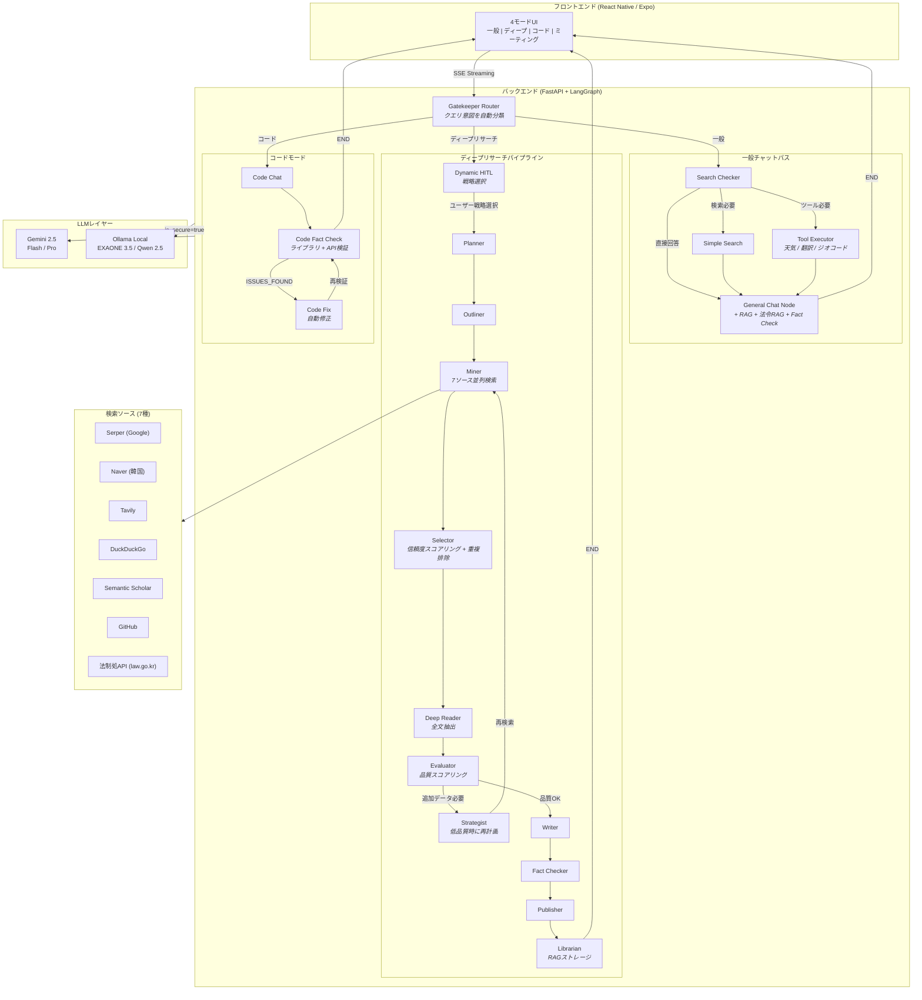
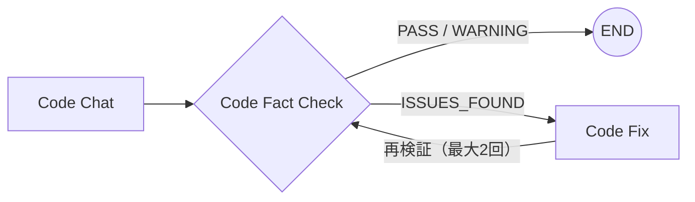

<div align="center">

# AI Secretary

### 高度なマルチモードAIアシスタント - ディープリサーチパイプライン搭載

クエリの複雑さに応じて最適な応答戦略を自動選択するLLMエージェントシステム。即時チャットからマルチソースの深層リサーチレポートまで対応。

[**English**](./README.md) | [**日本語**](./README.ja.md) | [**한국어**](./README.ko.md)

[](https://python.org)
[](https://fastapi.tiangolo.com)
[](https://langchain-ai.github.io/langgraph/)
[](https://reactnative.dev)
[](https://ai.google.dev)

</div>

---

## 概要

**AI Secretary**は、LangGraphのStateGraphアーキテクチャ（19ノード、条件付きエッジ）上に構築されたプロダクションレディなLLMエージェントシステムです。単純なチャットボットラッパーとは異なり、**多段階リサーチパイプライン**を実装しており、自動品質評価、自己修正型検索ループ、ファクトチェック機能を備えています。7種類の検索ソースから引用付きの構造化レポートを生成します。

**ハイブリッドLLMルーティング**（クラウドGemini + ローカルOllama）によるプライバシーセキュリティモード、**エージェンティック自己修正ループ**（コード検証）、**動的HITL**（リサーチ戦略選択）、**韓国法令RAGシステム**（法制処Open API連携）を搭載しています。

> **注記:** こちらはポートフォリオ展示用です。ソースコードはプライベートリポジトリで管理しています。

---

## 主要機能

### 一般チャット
- コンテキストを考慮した会話、必要に応じた自動ウェブ検索
- ハイブリッドキーワード抽出：ローカルLLMがキーワードを抽出し、クラウドLLMが検索クエリを最適化（プライバシー保護）
- RAG統合によるドキュメントベースの回答と`[doc p.N]`引用
- **法令RAG**: 法律関連クエリを自動検出し、条文レベルの引用で法的コンテキストを注入
- AI推奨フォローアップ質問による会話の継続性

### ディープリサーチ
- **動的HITL**: パイプライン進入前にLLMがクエリごとに2〜3つの分析戦略オプションを生成 → ユーザーが選択または自由入力
- 7種類の検索ソースから**2-4分**で包括的な分析レポートを生成
- 自己修正型品質ループ：Evaluatorがリサーチ品質をスコアリング、不足時はStrategistが再計画（最大3回）
- 出版前のソース素材との自動ファクトチェック
- セクション別ソースアコーディオン付きの構造化Markdownレポート

### コードアシスタント
- 自動検証付きの専用コード生成
- **エージェンティック自己修正ループ**: Code Fact Checkが問題を検出 → Code Fixが自動修正 → 再検証（最大2回）
- コードファクトチェッカーが公式ドキュメントとGitHubに対してライブラリ/APIを検証
- ローカルモデル（Qwen 2.5 Coder）とクラウドモデル（Gemini）の切り替え対応

### ミーティングインテリジェンス
- 話者分離（pyannote）+ 音声テキスト変換
- 話者ラベル付きセグメントでの自動会議要約生成

### リアルタイムツール
- **天気**: 韓国気象庁API（ランベルト正角円錐図法グリッド変換）
- **翻訳**: Naver Papago（韓/英/日/中）
- **ジオコーディング**: Naver Maps（住所→座標変換）

### 法令RAG
- 法制処国家法令情報センターOpen API (law.go.kr) による韓国法令検索
- ハイブリッド検索：ベクトル類似度 + BM25、Reciprocal Rank Fusion
- 条（article）単位のチャンキング + `[法令名 第N条]` 引用形式
- プライバシーHITL：法律クエリ時にセキュアモード（ローカル）/ クラウドモードを選択
- 対象法令14本（不動産9本 + セキュリティ/ネットワーク5本）

---

## システムアーキテクチャ



### アーキテクチャのハイライト

| 項目 | 設計判断 | 理由 |
|------|---------|------|
| **グラフエンジン** | LangGraph StateGraph（19ノード） | 決定論的ノードルーティング。ReActエージェントの予測不能なツール呼び出しより、複雑なパイプラインには明示的フロー制御が必要 |
| **品質ループ** | Evaluator → Strategist → Miner サイクル | 自己修正型リサーチ：ソース品質が閾値未満なら自動で再計画・再検索（最大3回） |
| **コード自己修正** | Code Fact Check ↔ Code Fix ループ | エージェンティックループ：問題検出 → 自動修正 → 再検証（最大2回） |
| **動的HITL** | LLM生成戦略オプション | クエリごとに2-3つの分析戦略 + ユーザー自由入力、Plannerに注入 |
| **LLMルーティング** | `is_secure_mode` フラグ | プライバシー重視のクエリはローカルGPU（EXAONE 3.5）で処理、それ以外はGeminiで品質確保 |
| **LLMゲートウェイ** | 4つの統合ゲートウェイ関数 | 全ノードが`ask_gemini*()`経由 — `is_secure`パラメータ1つでシステム全体を切り替え |
| **ハイブリッド検索** | ローカルキーワード抽出 + クラウドクエリ最適化 | セキュアモードではユーザーの原文がローカルマシンを離れない設計 |
| **法令RAG** | ベクトル + BM25ハイブリッド + 条文単位チャンキング | 韓国法令検索 + プライバシーHITL（セキュア/クラウドモード選択） |
| **チェックポイント** | AsyncSqliteSaver | サーバー再起動後もセッション復元可能 |

---

## 技術スタック

### バックエンド
| 技術 | 役割 |
|------|------|
| **Python 3.11** | ランタイム |
| **FastAPI** | 非同期REST API + SSEストリーミング |
| **LangGraph 1.0** | StateGraphワークフロー管理（19ノード、条件付きエッジ） |
| **Gemini 2.5 Flash/Pro** | メインクラウドLLM |
| **Ollama + EXAONE 3.5** | ローカルLLM（韓国語最適化、7.8B） |
| **Qwen 2.5 Coder** | ローカルコード生成モデル |

### フロントエンド
| 技術 | 役割 |
|------|------|
| **React Native (Expo)** | クロスプラットフォームモバイルアプリ |
| **TypeScript** | 型安全な開発 |
| **EventSource** | リアルタイムSSEストリーミング |
| **SimpleMarkdown** | 自作軽量Markdownレンダラー |

### AI / ML
| 技術 | 役割 |
|------|------|
| **sentence-transformers** | エンベディング生成（all-MiniLM-L6-v2 + ko-sroberta） |
| **Faster-Whisper** | 音声テキスト変換 |
| **pyannote.audio** | 話者分離 |
| **EasyOCR** | 画像テキスト抽出 |
| **PyMuPDF** | テーブル保持PDF解析 |

### 検索 & データ
| ソース | タイプ | 無料枠 |
|--------|--------|--------|
| **Serper.dev** | Google検索 | 2,500回/月 |
| **Naver検索** | 韓国ウェブ/ブログ/ニュース/百科 | 25,000回/日 |
| **Tavily** | ニュース + 学術 | 1,000回/月 |
| **DuckDuckGo** | 一般ウェブ | 無制限 |
| **Semantic Scholar** | 学術論文 | 無制限 |
| **GitHub** | コードリポジトリ | 5,000回/時 |
| **法制処API** | 韓国法令（law.go.kr） | 無制限 |

---

## モジュールアーキテクチャ

**6,300行のモノリス**から**9つの専門モジュール**にリファクタリング:

| モジュール | 行数 | 責務 |
|-----------|------|------|
| `config.py` | 60 | 環境変数、デプロイモード（local/cloud）、マルチバックエンド設定 |
| `models.py` | 287 | 状態定義（動的HITL/コード自己修正フィールド含む）、スキーマ、ドメイン信頼度ティア |
| `utils.py` | 523 | URL検証、信頼度スコアリング、テキスト処理 |
| `llm_gateway.py` | 447 | LLM統合ゲートウェイ、Gemini/Ollamaルーティング、マルチバックエンド拡張点 |
| `search.py` | 820 | 7ソースにまたがる11の検索関数 |
| `tools.py` | 417 | 天気 / 翻訳 / ジオコーディングAPI |
| `nodes_chat.py` | 1,218 | 一般チャット、コードモード、動的HITL、コード自己修正ノード |
| `nodes_research.py` | 3,000 | ディープリサーチパイプライン（11ノード、全ノードゲートウェイ統合） |
| `agent_mvp.py` | 254 | 再エクスポート + StateGraph組立（19ノード、条件付きエッジ） |

### デュアルデプロイ設計

```
                    .env: DEPLOY_MODE=local          .env: DEPLOY_MODE=cloud
                    ========================         ========================
LLMゲートウェイ       Gemini + Ollama (GPU)            Gemini only
セキュリティモード    利用可能（ローカルLLM）            無効
音声/ミーティング     有効（GPU STT）                    無効
コードモデル          Qwen 2.5 Coder（ローカル）         Gemini
依存関係              フル（torch, pyannote...）         軽量
```

`DEPLOY_MODE`環境変数1つで個人用（GPU）とクラウド（SaaS）構成を切り替えます。

---

## エージェンティック推論

### 1. コードモード — 自己修正ループ

コード生成後、**自動検証 → 問題検出 → 自動修正 → 再検証**のエージェンティックループ：



- **Code Fact Check**: 生成されたコードからライブラリ/APIを抽出 → 公式ドキュメント + GitHub検索で実在を検証
- **Code Fix**: ISSUES_FOUND判定時にLLMが検証結果を参照して自動修正
- **再検証**: 修正されたコードを再度Fact Check → 最大2回繰り返し後にユーザーに提供

### 2. 動的HITL (Human-in-the-Loop)

ディープリサーチ進入時、クエリに合わせた分析戦略をLLMが動的に生成：

1. ユーザーの質問 → LLMが2〜3つの分析戦略オプションを生成（JSON）
2. SSEでフロントエンドにオプション配列を送信
3. フロントエンドで動的ボタンレンダリング + 自由入力（TextInput）を提供
4. ユーザー選択 → `selected_option`値がPlannerに注入
5. Plannerが選択された戦略に合わせて`refined_topic`と研究方向を調整

**カスタム入力:** `custom:`プレフィックス規約でLLM生成オプションとユーザー自由入力を区別。

### 3. LLMゲートウェイ統合

全ノード（ディープリサーチ11個 + チャット + コード）のLLM呼び出しを4つのゲートウェイ関数に統合：

| 関数 | 用途 |
|------|------|
| `ask_gemini()` | 一般テキスト応答 |
| `ask_gemini_json()` | JSON構造化応答 |
| `ask_gemini_high()` | Proモデル優先（Flashフォールバック） |
| `ask_gemini_high_json()` | Pro + JSON |

`is_secure`パラメータ1つでシステム全体のGemini（クラウド）↔ Ollama（ローカル）を切り替え。

### 4. 法令RAG + プライバシーHITL

法律関連クエリ検出時、プライバシー選択を先に提示：

1. ユーザーのクエリから法律キーワードを検出
2. セキュリティモードOFF時 → プライバシーHITLボタンを表示
3. ユーザーが選択：セキュアモード（ローカルLLM）またはクラウドモード（Gemini）
4. RAG検索はローカルで実行 → 法的コンテキストを注入
5. 条文単位の引用 + 免責事項付きの最終回答を生成

---

## パフォーマンス最適化

| 指標 | 変更前（全クエリDeep Research） | 変更後（スマートルーティング） | 改善率 |
|------|-------------------------------|------------------------------|--------|
| 平均応答時間 | 全クエリ2-4分 | 一般チャット1-5秒 | 一般クエリで**95%短縮** |
| 検索API呼び出し | クエリ当たり14回以上（Tavily） | クエリ当たり0-3回（Serper） | **約80%削減** |
| LLMトークン使用量 | 毎回フルパイプライン | 複雑さに応じて比例 | 大幅削減 |

**Gatekeeper Router**が受信クエリを2つの主要パスに分類：
1. **一般チャット** — 簡単な質問、ファクトチェック、検索可能なクエリは即座に応答。検索とクイックファクトチェックはチャットノード内でインライン処理
2. **ディープリサーチ** — 複合的な分析のみが完全な11ノードパイプラインを起動

この2層ルーティング（Gatekeeper → Search Checker）により、大多数のクエリで不要な計算を排除しています。

---

## APIエンドポイント

| エンドポイント | メソッド | 説明 |
|--------------|---------|------|
| `/health` | GET | サーバーヘルスチェック |
| `/ai_secretary/stream_v2` | POST | メインチャット（SSEストリーミング） |
| `/ai_secretary/switch_model` | POST | Ollamaモデル切り替え（コードモード） |
| `/voice/chat` | POST | 音声入力 → STT → LLM → 応答 |
| `/meeting/upload` | POST | 会議音声 → 話者分離 + 要約 |
| `/rag/upload` | POST | PDF/画像RAG取り込み |
| `/rag/search` | GET | ベクトル類似度検索 |
| `/rag/stats` | GET | ベクトルストア統計 |
| `/tools/weather` | GET | 天気予報（気象庁API） |
| `/tools/translate` | POST | 翻訳（Papago） |
| `/tools/geocode` | GET | 住所→座標（Naver Maps） |
| `/law/crawl` | POST | 法制処クロール |
| `/law/search` | GET | 法令検索（Vector + BM25ハイブリッド） |
| `/law/update` | POST | 変更法令のみ再クロール |

---

## 設計判断

### LangGraph StateGraphをReAct Agentの代わりに選択した理由

ReActエージェントはツールを動的に選択する強みがありますが、複雑な多段階ワークフローでは**予測不能**です。19ノードのワークフローに必要なもの：
- 保証された実行順序（検索 → 評価 → 執筆）
- リトライロジックを含む条件分岐（Evaluator → Strategist → Miner、最大3回）
- エージェンティックループ：コード自己修正（code_fact_check ↔ code_fix、最大2回）
- SSEリアルタイム進捗更新 + 動的HITLオプション配信
- サーバー再起動後のセッション復元（AsyncSqliteSaverチェックポイント）

StateGraphは明示的な条件付きエッジによる**決定論的ルーティング**を提供し、パイプラインのデバッグと再現を可能にします。

### 7ソースハイブリッド検索を選択した理由

単一の検索APIでは全てのニーズを満たせません：
- **Serper**（Google）：最高の汎用カバレッジ、無料枠制限あり
- **Naver**：韓国語ソースに必須（日25,000回無料）
- **Semantic Scholar**：引用データ付き学術論文
- **GitHub**：コード関連リサーチ
- **DuckDuckGo**：無制限フォールバック
- **Tavily**：ニュースに強いが、大規模利用ではコスト課題
- **法制処API**（law.go.kr）：条文レベルの精度での韓国法令

### ベクトルストレージにSQLiteを選択した理由

個人/小規模チームのデプロイ向け：
- ゼロインフラオーバーヘッド（Pinecone/Weaviate/Chromaサーバー不要）
- 単一ファイルバックアップとマイグレーション
- <100Kドキュメントの規模でNumPyコサイン類似度が十分高速
- クラウドデプロイコストを大幅削減

---

## デモ

> スクリーンショットとデモ動画は追加予定です。

*近日公開: 一般チャット、ディープリサーチパイプライン、コードモードのライブデモGIF。*

---

## お問い合わせ

**フリーランスLLMエージェントシステム開発を承ります。**

プロダクショングレードのAIエージェントシステムを設計から本番環境まで構築します。

以下のようなニーズにお応えします：
- ビジネスドメイン特化のカスタムLLMエージェントパイプライン
- ドメイン固有のドキュメント取り込みを伴うRAGシステム
- マルチソースリサーチ自動化ツール
- ハイブリッドクラウド/オンプレミスAIデプロイメント

お気軽にご連絡ください。

- Email: parupin72@gmail.com
<!-- - LinkedIn: [Your Profile](https://linkedin.com/in/yourprofile) -->
- GitHub: [@leovis87](https://github.com/leovis87)

---

<div align="center">

*LangGraph、FastAPI、Gemini、そして大量のコーヒーで構築。*

</div>
