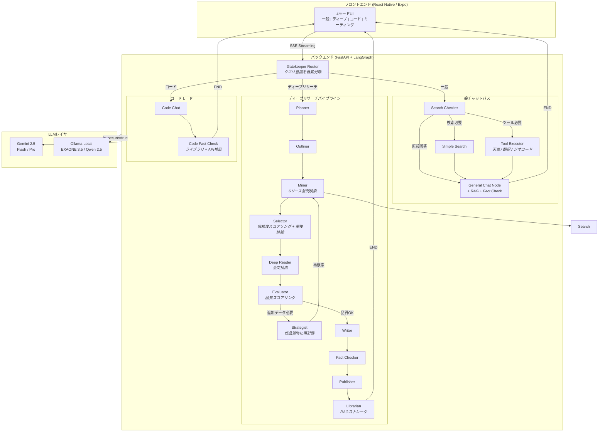

# AI Secretary

### 高度なマルチモードAIアシスタント - ディープリサーチパイプライン搭載

クエリの複雑さに応じて最適な応答戦略を自動選択するLLMエージェントシステム。即時チャットからマルチソースの深層リサーチレポートまで対応。

[**English**](./README.md) | [**日本語**](./README.ja.md) | [**한국어**](./README.ko.md)

---

## 概要

**AI Secretary**は、LangGraphのStateGraphアーキテクチャ上に構築されたプロダクションレディなLLMエージェントシステムです。単純なチャットボットラッパーとは異なり、**多段階リサーチパイプライン**を実装しており、自動品質評価、自己修正型検索ループ、ファクトチェック機能を備えています。6種類以上の検索ソースから引用付きの構造化レポートを生成します。

**ハイブリッドLLMルーティング**（クラウドGemini + ローカルOllama）を採用し、プライバシーに配慮したセキュリティモードを搭載。**モジュラーアーキテクチャ**によりデュアルデプロイ（ローカルGPUサーバー / クラウドSaaS）に対応しています。

> **注記:** こちらはポートフォリオ展示用です。ソースコードはプライベートリポジトリで管理しています。

---

## 主要機能

### 一般チャット
- コンテキストを考慮した会話、必要に応じた自動ウェブ検索
- ハイブリッドキーワード抽出：ローカルLLMがキーワードを抽出し、クラウドLLMが検索クエリを最適化（プライバシー保護）
- RAG統合によるドキュメントベースの回答と`[doc p.N]`引用
- AI推奨フォローアップ質問による会話の継続性

### ディープリサーチ
- 6種類以上の検索ソースから**2-4分**で包括的な分析レポートを生成
- 自己修正型品質ループ：Evaluatorがリサーチ品質をスコアリング、不足時はStrategistが再計画
- 出版前のソース素材との自動ファクトチェック
- セクション別ソースアコーディオン付きの構造化Markdownレポート

### コードアシスタント
- 自動検証付きの専用コード生成
- コードファクトチェッカーが公式ドキュメントとGitHubに対してライブラリ/APIを検証
- ローカルモデル（Qwen 2.5 Coder）とクラウドモデル（Gemini）の切り替え対応

### ミーティングインテリジェンス
- 話者分離（pyannote）+ 音声テキスト変換
- 話者ラベル付きセグメントでの自動会議要約生成

### リアルタイムツール
- **天気**: 韓国気象庁API（ランベルト正角円錐図法グリッド変換）
- **翻訳**: Naver Papago（韓/英/日/中）
- **ジオコーディング**: Naver Maps（住所→座標変換）

---

## システムアーキテクチャ

### アーキテクチャのハイライト

| 項目 | 設計判断 | 理由 |
|------|---------|------|
| **グラフエンジン** | LangGraph StateGraph | 決定論的ノードルーティング。ReActエージェントの予測不能なツール呼び出しより、複雑なパイプラインには明示的フロー制御が必要 |
| **品質ループ** | Evaluator → Strategist → Miner サイクル | 自己修正型リサーチ：ソース品質が閾値未満なら自動で再計画・再検索 |
| **LLMルーティング** | `is_secure_mode` フラグ | プライバシー重視のクエリはローカルGPU（EXAONE 3.5）で処理、それ以外はGeminiで品質確保 |
| **ハイブリッド検索** | ローカルキーワード抽出 + クラウドクエリ最適化 | セキュアモードではユーザーの原文がローカルマシンを離れない設計 |
| **チェックポイント** | AsyncSqliteSaver | サーバー再起動後もセッション復元可能 |

---

## 技術スタック

### バックエンド
| 技術 | 役割 |
|------|------|
| **Python 3.11** | ランタイム |
| **FastAPI** | 非同期REST API + SSEストリーミング |
| **LangGraph 1.0** | StateGraphワークフロー管理 |
| **Gemini 2.5 Flash/Pro** | メインクラウドLLM |
| **Ollama + EXAONE 3.5** | ローカルLLM（韓国語最適化、7.8B） |
| **Qwen 2.5 Coder** | ローカルコード生成モデル |

### フロントエンド
| 技術 | 役割 |
|------|------|
| **React Native (Expo)** | クロスプラットフォームモバイルアプリ |
| **TypeScript** | 型安全な開発 |
| **EventSource** | リアルタイムSSEストリーミング |

### AI / ML
| 技術 | 役割 |
|------|------|
| **sentence-transformers** | エンベディング生成 |
| **Faster-Whisper** | 音声テキスト変換 |
| **pyannote.audio** | 話者分離 |
| **EasyOCR** | 画像テキスト抽出 |
| **PyMuPDF** | テーブル保持PDF解析 |

---

## モジュールアーキテクチャ

**6,300行のモノリス**から**9つの専門モジュール**にリファクタリング（オーケストレーションファイル239行 + モジュール合計6,400行）:

| モジュール | 行数 | 責務 |
|-----------|------|------|
| `config.py` | 36 | 環境変数、デプロイモード（local/cloud） |
| `models.py` | 232 | 状態定義、Pydanticスキーマ、ドメイン信頼度ティア |
| `utils.py` | 523 | URL検証、信頼度スコアリング、テキスト処理 |
| `llm_gateway.py` | 419 | LLM初期化、Gemini/Ollamaルーティング |
| `search.py` | 820 | 6ソースにまたがる11の検索関数 |
| `tools.py` | 417 | 天気 / 翻訳 / ジオコーディングAPI |
| `nodes_chat.py` | 968 | 一般チャット、コードモード、検索ルーティングノード |
| `nodes_research.py` | 2,987 | ディープリサーチパイプライン（11ノード） |
| `agent_mvp.py` | 239 | 再エクスポート + StateGraph組立 |

---

## パフォーマンス最適化

| 指標 | ディープリサーチのみ | スマートルーティング適用後 | 改善率 |
|------|-------------------|----------------------|--------|
| 平均応答時間 | 2-4分 | 5-10秒（一般） | **95% 短縮** |
| クエリ当たりAPI呼び出し | 14回以上 | 2-3回 | **86% 削減** |
| LLMトークン使用量 | 高コスト | 必要に応じて比例 | **87% 削減** |

---

## デモ

> スクリーンショットとデモ動画は追加予定です。

*近日公開: 一般チャット、ディープリサーチパイプライン、コードモードのライブデモGIF。*

---

## お問い合わせ

**フリーランスLLMエージェントシステム開発を承ります。**

プロダクショングレードのAIエージェントシステムを設計から本番環境まで構築します。

以下のようなニーズにお応えします：
- ビジネスドメイン特化のカスタムLLMエージェントパイプライン
- ドメイン固有のドキュメント取り込みを伴うRAGシステム
- マルチソースリサーチ自動化ツール
- ハイブリッドクラウド/オンプレミスAIデプロイメント

お気軽にご連絡ください。

<!--
- Email: your@email.com
- LinkedIn: [Your Profile](https://linkedin.com/in/yourprofile)
-->

---

*LangGraph、FastAPI、Gemini、そして大量のコーヒーで構築。*

