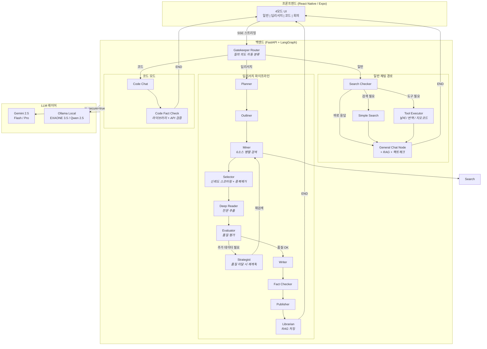

<div align="center">

# AI Secretary

### 지능형 멀티모드 AI 비서 - 딥리서치 파이프라인 탑재

질문의 복잡도에 따라 최적의 응답 전략을 자동 선택하는 LLM 에이전트 시스템. 즉시 채팅부터 멀티소스 심층 분석 리포트까지.

[**English**](./README.md) | [**日本語**](./README.ja.md) | [**한국어**](./README.ko.md)

[](https://python.org)
[](https://fastapi.tiangolo.com)
[](https://langchain-ai.github.io/langgraph/)
[](https://reactnative.dev)
[](https://ai.google.dev)

</div>

---

## 개요

**AI Secretary**는 LangGraph StateGraph 아키텍처 기반의 프로덕션 레벨 LLM 에이전트 시스템입니다. 단순한 챗봇 래퍼가 아닌, **다단계 리서치 파이프라인**을 구현하여 자동 품질 평가, 자기 수정 검색 루프, 팩트체크 기능을 갖추고 있습니다. 6개 이상의 검색 소스에서 인용 출처가 포함된 구조화된 리포트를 생성합니다.

**하이브리드 LLM 라우팅**(클라우드 Gemini + 로컬 Ollama)을 적용하여 개인정보 보호가 필요한 질의에는 보안 모드를 제공하며, **모듈러 아키텍처**로 듀얼 배포(로컬 GPU 서버 / 클라우드 SaaS)를 지원합니다.

> **참고:** 본 레포지토리는 포트폴리오 쇼케이스입니다. 소스 코드는 프라이빗 레포지토리에서 관리됩니다.

---

## 주요 기능

### 일반 채팅
- 컨텍스트 기반 대화, 필요 시 자동 웹 검색
- 하이브리드 키워드 추출: 로컬 LLM이 키워드 추출 → 클라우드 LLM이 검색 쿼리 최적화 (프라이버시 보호)
- RAG 통합으로 문서 기반 응답 + `[doc p.N]` 인용 제공
- AI 추천 후속 질문으로 대화 지속성 확보

### 딥리서치
- 6개 이상의 검색 소스에서 **2-4분** 내 종합 분석 리포트 생성
- 자기 수정 품질 루프: Evaluator가 리서치 품질 평가 → 미달 시 Strategist가 재계획
- 출판 전 소스 자료 대비 자동 팩트체크
- 섹션별 출처 아코디언이 포함된 구조화 마크다운 리포트

### 코드 어시스턴트
- 자동 검증 기능을 갖춘 전용 코드 생성
- 코드 팩트체커가 공식 문서 + GitHub 기반으로 라이브러리/API 검증
- 로컬 모델(Qwen 2.5 Coder)과 클라우드 모델(Gemini) 전환 지원

### 회의 인텔리전스
- 화자 분리(pyannote) + 음성-텍스트 변환
- 화자 레이블이 포함된 자동 회의 요약 생성

### 실시간 도구
- **날씨**: 기상청 단기예보 API + 람베르트 정각원추도법 격자 변환
- **번역**: 네이버 파파고 (한/영/일/중)
- **지오코딩**: 네이버 지도 주소→좌표 변환

---

## 시스템 아키텍처



### 아키텍처 하이라이트

| 항목 | 설계 결정 | 이유 |
|------|---------|------|
| **그래프 엔진** | LangGraph StateGraph | 결정론적 노드 라우팅. ReAct 에이전트의 예측 불가능한 도구 호출 대비, 복잡한 파이프라인에는 명시적 플로우 제어가 필수 |
| **품질 루프** | Evaluator → Strategist → Miner 사이클 | 자기 수정형 리서치: 소스 품질이 기준 미달이면 자동으로 재계획·재검색 |
| **LLM 라우팅** | `is_secure_mode` 플래그 | 프라이버시가 중요한 질의는 로컬 GPU(EXAONE 3.5)에서 처리, 나머지는 Gemini |
| **하이브리드 검색** | 로컬 키워드 추출 + 클라우드 쿼리 최적화 | 보안 모드에서 사용자 원문은 로컬 머신을 벗어나지 않는 설계 |
| **체크포인팅** | AsyncSqliteSaver | 서버 재시작 후에도 세션 복원 가능 |

---

## 기술 스택

### 백엔드
| 기술 | 역할 |
|------|------|
| **Python 3.11** | 런타임 |
| **FastAPI** | 비동기 REST API + SSE 스트리밍 |
| **LangGraph 1.0** | StateGraph 워크플로우 오케스트레이션 |
| **Gemini 2.5 Flash/Pro** | 메인 클라우드 LLM |
| **Ollama + EXAONE 3.5** | 로컬 LLM (한국어 최적화, 7.8B) |
| **Qwen 2.5 Coder** | 로컬 코드 생성 모델 |

### 프론트엔드
| 기술 | 역할 |
|------|------|
| **React Native (Expo)** | 크로스플랫폼 모바일 앱 |
| **TypeScript** | 타입 안전 개발 |
| **EventSource** | 실시간 SSE 스트리밍 |

### AI / ML
| 기술 | 역할 |
|------|------|
| **sentence-transformers** | 임베딩 생성 (all-MiniLM-L6-v2) |
| **Faster-Whisper** | 음성-텍스트 변환 |
| **pyannote.audio** | 화자 분리 |
| **EasyOCR** | 이미지 텍스트 추출 |
| **PyMuPDF** | 테이블 보존 PDF 파싱 |

### 검색 & 데이터
| 소스 | 유형 | 무료 할당량 |
|------|------|-----------|
| **Serper.dev** | Google 검색 | 2,500회/월 |
| **네이버 검색** | 한국 웹/블로그/뉴스/백과 | 25,000회/일 |
| **Tavily** | 뉴스 + 학술 | 1,000회/월 |
| **DuckDuckGo** | 일반 웹 | 무제한 |
| **Semantic Scholar** | 학술 논문 | 무제한 |
| **GitHub** | 코드 저장소 | 5,000회/시 |

---

## 모듈 아키텍처

**6,300줄 모놀리스**에서 **9개 전문 모듈**로 리팩토링 (오케스트레이션 파일 239줄 + 모듈 합계 6,400줄):

| 모듈 | 줄 수 | 책임 |
|------|------|------|
| `config.py` | 36 | 환경변수, 배포 모드 (local/cloud) |
| `models.py` | 232 | 상태 정의, Pydantic 스키마, 도메인 신뢰도 티어 |
| `utils.py` | 523 | URL 검증, 신뢰도 스코어링, 텍스트 처리 |
| `llm_gateway.py` | 419 | LLM 초기화, Gemini/Ollama 라우팅, 게이트웨이 함수 |
| `search.py` | 820 | 6개 소스에 걸친 11개 검색 함수 |
| `tools.py` | 417 | 날씨 / 번역 / 지오코딩 API |
| `nodes_chat.py` | 968 | 일반 채팅, 코드 모드, 검색 라우팅 노드 |
| `nodes_research.py` | 2,987 | 딥리서치 파이프라인 (11개 노드) |
| `agent_mvp.py` | 239 | 재수출 + StateGraph 조립 |

### 듀얼 배포 설계

```
                    .env: DEPLOY_MODE=local          .env: DEPLOY_MODE=cloud
                    ========================         ========================
LLM Gateway         Gemini + Ollama (GPU)            Gemini only
보안 모드             사용 가능 (로컬 LLM)              비활성화
음성/회의             활성화 (GPU STT)                  비활성화
코드 모델             Qwen 2.5 Coder (로컬)             Gemini
의존성               전체 (torch, pyannote...)          경량
```

`DEPLOY_MODE` 환경변수 하나로 개인용(GPU)과 클라우드(SaaS) 구성을 전환합니다.

---

## 딥리서치 파이프라인 상세

딥리서치 모드는 이 시스템의 핵심 차별점입니다. 하나의 리서치 질의가 11개 전문 노드를 거치는 과정:

```
사용자: "AI 반도체 시장 경쟁 현황 분석해줘"
 |
 v
[1. Planner] - 질의 의도 분석, 리서치 모드 결정 (tech/biz/policy)
             - 정제된 주제와 목표 구조 생성
 |
 v
[2. Outliner] - 4-6개 섹션의 구조화된 목차 생성
              - 섹션별 최적화 검색 쿼리 생성
              - 쿼리 유형 분류로 소스 선택
 |
 v
[3. Miner] - 6개 소스 병렬 검색 (Serper + 네이버 + Tavily + ...)
           - 반복당 20-30개 원시 결과 수집
 |
 v
[4. Selector] - 신뢰도 스코어링: 도메인 티어(T1/T2/T3) + 스니펫 관련성
              - URL 검증 (비동기 배치 HEAD 요청)
              - 중복 제거 + Top-K 선별
 |
 v
[5. Deep Reader] - Crawl4AI를 통한 전문 추출
                 - 컨텍스트 윈도우 관리를 위한 장문 요약
 |
 v
[6. Evaluator] - 평가 항목: 커버리지, 깊이, 소스 다양성, 최신성
               - 판정: PASS (→ Writer) 또는 RETRY (→ Strategist)
 |
 v
[7. Strategist] (RETRY 시) - 커버리지 갭 식별
                            - 새로운 타겟 검색 쿼리 생성
                            - Miner로 재라우팅 (최대 3회 반복)
 |
 v
[8. Writer] - 구조화된 마크다운 리포트 생성
            - 섹션별 출처 인용
            - 독자 맞춤형 톤 (전문가 / 일반)
 |
 v
[9. Fact Checker] - 주장 내용을 소스 자료와 교차 검증
                  - 근거 없는 서술 플래그 처리
 |
 v
[10. Publisher] - 출처 아코디언이 포함된 최종 출력 포맷팅
               - 후속 질문 추천 생성
 |
 v
[11. Librarian] - 리서치 결과를 RAG 벡터 스토어에 저장
               - 향후 검색 및 교차 참조 지원
```

---

## 성능 최적화

| 지표 | 변경 전 (모든 질의 딥리서치) | 변경 후 (스마트 라우팅) | 개선율 |
|------|--------------------------|----------------------|--------|
| 평균 응답 시간 | 모든 질의 2-4분 | 일반 채팅 1-5초 | 단순 질의 **95% 단축** |
| 검색 API 호출 | 쿼리당 14회+ (Tavily) | 쿼리당 0-3회 (Serper) | **~80% 감소** |
| LLM 토큰 사용량 | 매번 전체 파이프라인 | 복잡도에 비례 | 대폭 감소 |

**Gatekeeper Router**가 들어오는 질의를 2개 주요 경로로 분류:
1. **일반 채팅** - 간단한 질문, 팩트체크, 검색 가능한 질의는 즉시 응답. 검색과 빠른 팩트체크는 채팅 노드 내부에서 인라인 처리
2. **딥리서치** - 복합적 다면 분석만 전체 11노드 파이프라인 가동

이 2계층 라우팅(Gatekeeper → Search Checker)으로 대부분의 질의에서 불필요한 연산을 제거.

---

## 설계 결정

### LangGraph StateGraph를 ReAct Agent 대신 선택한 이유

ReAct 에이전트는 도구를 동적으로 선택하는 강점이 있지만, 복잡한 다단계 워크플로우에서는 **예측 불가능**합니다. 딥리서치 파이프라인에 필요한 것:
- 보장된 실행 순서 (검색 → 평가 → 작성)
- 재시도 로직을 포함한 조건부 분기
- 11개 이상의 노드에 걸친 상태 영속성
- 프론트엔드로의 스트리밍 진행률 업데이트

StateGraph는 명시적 조건부 엣지를 통한 **결정론적 라우팅**을 제공하여 파이프라인을 디버깅하고 재현할 수 있게 합니다.

### 6개 소스 하이브리드 검색을 선택한 이유

단일 검색 API로는 모든 요구사항을 충족할 수 없습니다:
- **Serper** (Google): 최고의 범용 커버리지, 무료 한도 제한
- **네이버**: 한국어 소스 필수 (일 25,000회 무료)
- **Semantic Scholar**: 인용 데이터 포함 학술 논문
- **GitHub**: 코드 관련 리서치
- **DuckDuckGo**: 무제한 폴백
- **Tavily**: 뉴스에 강하나 대규모 사용 시 비용 부담

### 벡터 저장에 SQLite를 선택한 이유

개인/소규모 팀 배포 시:
- 제로 인프라 오버헤드 (Pinecone/Weaviate/Chroma 서버 불필요)
- 단일 파일 백업 및 마이그레이션
- <100K 문서 규모에서 NumPy 코사인 유사도로 충분한 성능
- 클라우드 배포 비용 대폭 절감

---

## 데모

> 스크린샷과 데모 영상은 추가 예정입니다.

*근일 공개: 일반 채팅, 딥리서치 파이프라인, 코드 모드 라이브 데모 GIF.*

---

## 연락처

**프리랜스 LLM 에이전트 시스템 개발을 진행하고 있습니다.**

프로덕션 레벨의 AI 에이전트 시스템을 설계부터 배포까지 구축합니다.

다음과 같은 니즈에 대응합니다:
- 비즈니스 도메인 특화 커스텀 LLM 에이전트 파이프라인
- 도메인 특화 문서 수집 RAG 시스템
- 멀티소스 리서치 자동화 도구
- 하이브리드 클라우드/온프레미스 AI 배포

편하게 연락 주세요.

- Email: parupin72@gmail.com
<!-- - LinkedIn: [Your Profile](https://linkedin.com/in/yourprofile) -->
- GitHub: [@leovis87](https://github.com/leovis87)

---

<div align="center">

*LangGraph, FastAPI, Gemini, 그리고 수많은 커피로 만들었습니다.*

</div>
