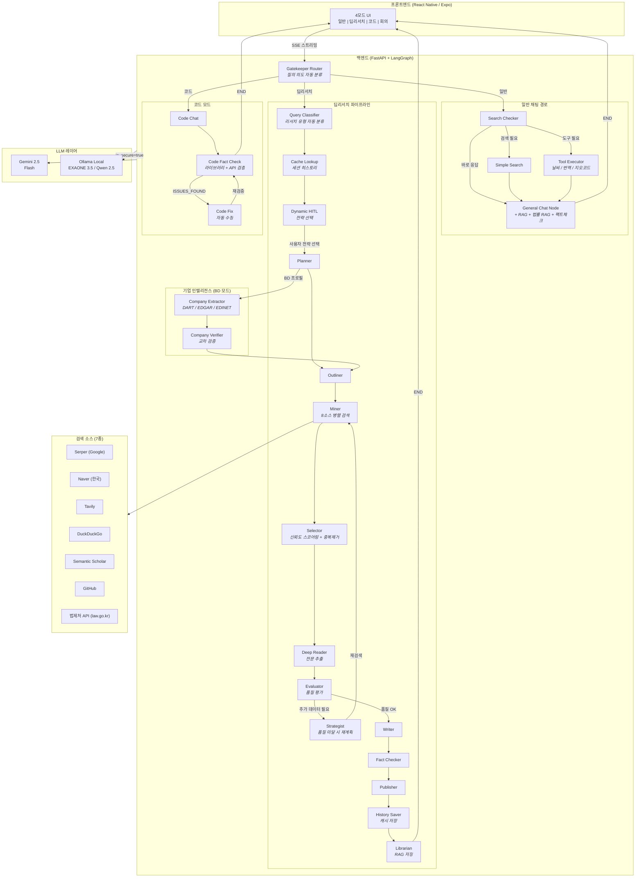
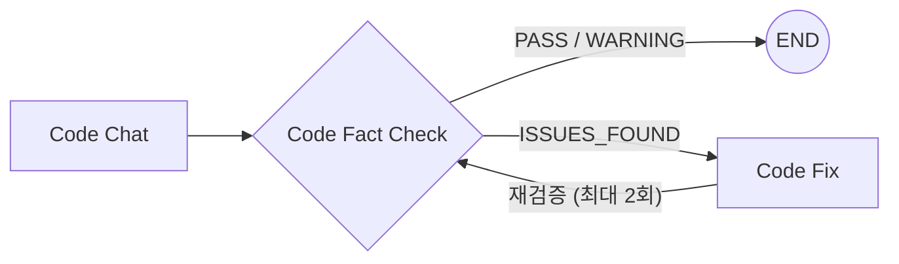
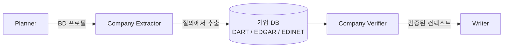

<div align="center">

# AI Secretary

### 지능형 멀티모드 AI 비서 - 딥리서치 파이프라인 탑재

질문의 복잡도에 따라 최적의 응답 전략을 자동 선택하는 LLM 에이전트 시스템. 즉시 채팅부터 기업 인텔리전스가 결합된 멀티소스 심층 분석 리포트까지.

[**English**](./README.md) | [**日本語**](./README.ja.md) | [**한국어**](./README.ko.md)

[](https://python.org)
[](https://fastapi.tiangolo.com)
[](https://langchain-ai.github.io/langgraph/)
[](https://reactnative.dev)
[](https://ai.google.dev)

</div>

---

## 개요

**AI Secretary**는 LangGraph StateGraph 아키텍처(24노드, 조건부 에지) 기반의 프로덕션 레벨 LLM 에이전트 시스템입니다. 단순한 챗봇 래퍼가 아닌, **다단계 리서치 파이프라인**을 구현하여 자동 품질 평가, 자기 수정 검색 루프, 팩트체크 기능을 갖추고 있습니다. 8개 검색 소스에서 인용 출처가 포함된 구조화된 리포트를 생성합니다.

**벤치마크 기반 하이브리드 LLM 라우팅**(클라우드 Gemini + 로컬 Ollama)으로 노드 단위 비용 최적화 라우팅을 제공하고, **자동 질의 분류기**가 사용자 개입 없이 리서치 프로필을 선택하며, **BD(사업개발) 리서치 모드**에서 다국적 기업 인텔리전스(DART/EDGAR/EDINET)를 활용합니다. **리서치 세션 캐시**, **에이전틱 자기수정 루프**(코드 검증), **동적 HITL**(리서치 전략 선택), **한국법 RAG 시스템**(법제처 Open API 연동)을 탑재했습니다.

**포괄적 테스트 스위트**(83+ 유닛 테스트)로 핵심 로직을 검증하며, **하이브리드 LLM 벤치마크 시스템**으로 데이터 기반 라우팅 결정을 수행합니다.

> **참고:** 본 레포지토리는 포트폴리오 쇼케이스입니다. 소스 코드는 프라이빗 레포지토리에서 관리됩니다.

---

## 이런 고민, 없으신가요?

- 📊 매일 반복되는 시장 조사 · 경쟁사 분석에 시간이 너무 오래 걸린다
- 🔁 고객 문의 대응에서 같은 질문에 반복적으로 답변하고 있다
- 🔍 사내 자료 검색이 불편해서 필요한 정보를 빠르게 찾을 수 없다
- 📝 리포트 작성을 자동화하고 싶지만 사내에 엔지니어가 없다

**AI Secretary는 이러한 과제를 AI로 자동화합니다.**

---

## 주요 기능

### 일반 채팅
- 컨텍스트 기반 대화, 필요 시 자동 웹 검색
- 하이브리드 키워드 추출: 로컬 LLM이 키워드 추출 → 클라우드 LLM이 검색 쿼리 최적화 (프라이버시 보호)
- RAG 통합으로 문서 기반 응답 + `[doc p.N]` 인용 제공
- **법률 RAG**: 법률 관련 질의 자동 감지 → 조문 단위 인용으로 법률 컨텍스트 주입
- AI 추천 후속 질문으로 대화 지속성 확보

### 딥리서치
- **질의 분류기**: 7가지 리서치 유형(market_entry, competitor_analysis, company_profile 등)을 로컬 LLM으로 자동 분류 — 클라우드 비용 제로
- **동적 HITL**: 파이프라인 진입 전 LLM이 질문별 2~3개 분석 전략 옵션 생성 → 사용자가 선택하거나 직접 입력
- **BD 프로필**: 사업개발 리서치 모드 — 특화 프롬프트, 기업 인텔리전스 주입, 시장 진입 분석
- **기업 인텔리전스**: DART(한국), EDGAR(미국), EDINET(일본) 다국적 기업 데이터 — 자동 추출, 교차 검증, 컨텍스트 주입
- **리서치 캐시**: 세션 히스토리 추적, URL 신뢰도 캐싱, 자동 태깅, 리서치 스냅샷
- 8개 검색 소스에서 **2-4분** 내 종합 분석 리포트 생성
- 자기 수정 품질 루프: Evaluator가 품질 평가 → 미달 시 Strategist가 재계획 (최대 3회)
- 출판 전 소스 자료 대비 자동 팩트체크
- 섹션별 출처 아코디언이 포함된 구조화 마크다운 리포트

### 코드 어시스턴트
- 자동 검증 기능을 갖춘 전용 코드 생성
- **에이전틱 자기수정 루프**: Code Fact Check가 문제 감지 → Code Fix가 자동 수정 → 재검증 (최대 2회)
- 코드 팩트체커가 공식 문서 + GitHub 기반으로 라이브러리/API 검증
- 로컬 모델(Qwen 2.5 Coder)과 클라우드 모델(Gemini) 전환 지원

### 회의 인텔리전스
- 화자 분리(pyannote) + 음성-텍스트 변환
- 화자 레이블이 포함된 자동 회의 요약 생성

### 실시간 도구
- **날씨**: 기상청 단기예보 API + 람베르트 정각원추도법 격자 변환
- **번역**: 네이버 파파고 (한/영/일/중)
- **지오코딩**: 네이버 지도 주소→좌표 변환

### 법률 RAG
- 법제처 국가법령정보센터 Open API (law.go.kr) 연동 한국법 검색
- 하이브리드 검색: 벡터 유사도 + BM25, Reciprocal Rank Fusion
- 조(article) 단위 청킹 + `[법령명 제N조]` 인용 포맷
- 프라이버시 HITL: 법률 질의 시 보안 모드(로컬) / 클라우드 모드 선택
- 대상 법률 14개 (부동산 9개 + 보안/네트워크 5개)

---

## 시스템 아키텍처



### 아키텍처 하이라이트

| 항목 | 설계 결정 | 이유 |
|------|---------|------|
| **그래프 엔진** | LangGraph StateGraph (24노드) | 결정론적 노드 라우팅. ReAct 에이전트의 예측 불가능한 도구 호출 대비, 복잡한 파이프라인에는 명시적 플로우 제어 필수 |
| **질의 분류기** | 로컬 LLM 자동 분류 | EXAONE 7B로 7가지 리서치 유형 자동 분류 — 클라우드 비용 제로, 프론트엔드 오버라이드 지원 |
| **품질 루프** | Evaluator → Strategist → Miner 사이클 | 자기 수정형 리서치: 소스 품질 미달 시 자동 재계획·재검색 (최대 3회) |
| **코드 자기수정** | Code Fact Check ↔ Code Fix 루프 | 에이전틱 루프: 문제 감지 → 자동 수정 → 재검증 (최대 2회) |
| **동적 HITL** | LLM 생성 전략 옵션 | 질문별 2-3개 분석 전략 + 사용자 자유 입력, Planner에 주입 |
| **BD 프로필** | 사업개발 리서치 모드 | 특화 프롬프트 + 기업 인텔리전스 (DART/EDGAR/EDINET) 시장 진입 분석 |
| **기업 인텔리전스** | 다국적 기업 DB | DART(한국), EDGAR(미국), EDINET(일본) — 추출 + 검증 노드, 교차 소스 검증 |
| **리서치 캐시** | SQLite 세션 + URL 캐시 | 세션 히스토리 추적, URL 신뢰도 캐싱, 자동 태깅, 리서치 스냅샷 |
| **LLM 라우팅** | 벤치마크 기반 하이브리드 라우팅 | `is_secure` > `hybrid_mode` > `default(cloud)` 우선순위 체인. 노드 단위 로컬/클라우드 할당 |
| **LLM Gateway** | 4개 통합 게이트웨이 함수 | 모든 노드가 `ask_gemini*()` 경유 — `is_secure` 파라미터 하나로 전체 시스템 전환 |
| **하이브리드 검색** | 로컬 키워드 추출 + 클라우드 쿼리 최적화 | 보안 모드에서 사용자 원문은 로컬 머신을 벗어나지 않는 설계 |
| **법률 RAG** | 벡터 + BM25 하이브리드 + 조문 단위 청킹 | 한국법 검색 + 프라이버시 HITL (보안/클라우드 모드 선택) |
| **체크포인팅** | AsyncSqliteSaver | 서버 재시작 후에도 세션 복원 가능 |
| **테스트** | 83+ pytest 유닛 테스트 | 의존성 모킹을 통한 순수 로직 테스트 — 포맷터, 모델, 캐시, 벤치마크, URL 보정 |

---

## 기술 스택

### 백엔드
| 기술 | 역할 |
|------|------|
| **Python 3.11** | 런타임 |
| **FastAPI** | 비동기 REST API + SSE 스트리밍 |
| **LangGraph 1.0** | StateGraph 워크플로우 오케스트레이션 (24노드, 조건부 에지) |
| **Gemini 2.5 Flash** | 단일 클라우드 LLM — 벤치마크 검증 완료: Pro 대비 -4% 품질 차, 2배 속도 |
| **Ollama + EXAONE 3.5** | 로컬 LLM (한국어 최적화, 7.8B) |
| **Qwen 2.5 Coder** | 로컬 코드 생성 모델 |

### 프론트엔드
| 기술 | 역할 |
|------|------|
| **React Native (Expo)** | 크로스플랫폼 모바일 앱 |
| **TypeScript** | 타입 안전 개발 |
| **EventSource** | 실시간 SSE 스트리밍 |
| **SimpleMarkdown** | 자체 구현 경량 마크다운 렌더러 |

### AI / ML
| 기술 | 역할 |
|------|------|
| **sentence-transformers** | 임베딩 생성 (all-MiniLM-L6-v2 + ko-sroberta) |
| **Faster-Whisper** | 음성-텍스트 변환 |
| **pyannote.audio** | 화자 분리 |
| **EasyOCR** | 이미지 텍스트 추출 |
| **PyMuPDF** | 테이블 보존 PDF 파싱 |

### 검색 & 데이터
| 소스 | 유형 | 무료 할당량 |
|------|------|-----------|
| **Serper.dev** | Google 검색 | 2,500회/월 |
| **네이버 검색** | 한국 웹/블로그/뉴스/백과 | 25,000회/일 |
| **Tavily** | 뉴스 + 학술 | 1,000회/월 |
| **DuckDuckGo** | 일반 웹 | 무제한 |
| **Semantic Scholar** | 학술 논문 (인용 데이터) | 무제한 |
| **arXiv** | 프리프린트 논문 (CS/AI/수학) | 무제한 |
| **GitHub** | 코드 저장소 | 5,000회/시 |
| **법제처 API** | 한국 법령 (law.go.kr) | 무제한 |

---

## 모듈 아키텍처

**6,300줄 모놀리스**에서 **14개 이상의 전문 모듈**로 리팩토링:

| 모듈 | 줄 수 | 책임 |
|------|------|------|
| `config.py` | 89 | 환경변수, 배포 모드, 하이브리드 라우팅 설정 |
| `models.py` | 323 | 상태 정의 (HITL + BD 프로필 + 질의 분류기 필드), 스키마, 도메인 신뢰도 티어 |
| `utils.py` | 547 | URL 검증, 신뢰도 스코어링, 텍스트 처리 |
| `llm_gateway.py` | 485 | LLM 통합 게이트웨이, Gemini/Ollama 라우팅, 하이브리드 모드 전환 |
| `search.py` | 865 | 8개 소스에 걸친 11개 검색 함수 |
| `tools.py` | 417 | 날씨 / 번역 / 지오코딩 API |
| `nodes_chat.py` | 1,156 | 일반 채팅, 코드 모드, 질의 분류기, HITL 노드 |
| `nodes_research.py` | 3,401 | 딥리서치 파이프라인 (11개 노드, 전 노드 게이트웨이 통합) |
| `nodes_company.py` | 491 | 기업 추출 + 검증 노드 (BD 프로필) |
| `research_cache.py` | 798 | 리서치 세션 캐시, URL 신뢰도 추적, 자동 태깅 |
| `company_store.py` | 791 | 기업 인텔리전스 DB + 다국적 커넥터 |
| `company_connectors/` | 1,362 | DART(한국), EDGAR(미국), EDINET(일본), 웹 보강 |
| `law_rag.py` | 1,440 | 한국법 RAG (벡터 + BM25 하이브리드, 조문 단위 청킹) |
| `tag_enums.py` | 304 | 리서치 태그 분류 시스템 |
| `agent_mvp.py` | 304 | 재수출 + StateGraph 조립 (24노드, 조건부 에지) |

### 듀얼 배포 설계

```
                    .env: DEPLOY_MODE=local          .env: DEPLOY_MODE=cloud
                    ========================         ========================
LLM Gateway         Gemini + Ollama (GPU)            Gemini only
보안 모드             사용 가능 (로컬 LLM)              비활성화
음성/회의             활성화 (GPU STT)                  비활성화
코드 모델             Qwen 2.5 Coder (로컬)             Gemini
의존성               전체 (torch, pyannote...)          경량
```

`DEPLOY_MODE` 환경변수 하나로 개인용(GPU)과 클라우드(SaaS) 구성을 전환합니다.

---

## 에이전틱 추론

### 1. 코드 모드 — 자기수정 루프

코드 생성 후 **자동 검증 → 문제 감지 → 자동 수정 → 재검증**하는 에이전틱 루프:



- **Code Fact Check**: 생성된 코드에서 라이브러리/API를 추출 → 공식 문서 + GitHub 검색으로 실제 존재 여부 검증
- **Code Fix**: ISSUES_FOUND 판정 시 LLM이 검증 결과를 참고하여 자동 수정
- **재검증**: 수정된 코드를 다시 Fact Check → 최대 2회 반복 후 사용자에게 전달

### 2. 동적 HITL (Human-in-the-Loop)

딥리서치 진입 시, 질문에 맞는 분석 전략을 LLM이 동적으로 생성:

1. 사용자 질문 → LLM이 2~3개 분석 전략 옵션 생성 (JSON)
2. SSE로 프론트엔드에 옵션 배열 전달
3. 프론트엔드에서 동적 버튼 렌더링 + 직접 입력(TextInput) 제공
4. 사용자 선택 → `selected_option` 값이 Planner에 주입
5. Planner가 선택된 전략에 맞게 `refined_topic`과 연구 방향 조정

**커스텀 입력:** `custom:` 접두사 규약으로 LLM 생성 옵션과 사용자 자유 입력을 구분.

### 3. LLM Gateway 통합

모든 노드(11개 딥리서치 + 채팅 + 코드)의 LLM 호출을 4개 게이트웨이 함수로 통합:

| 함수 | 용도 |
|------|------|
| `ask_gemini()` | 일반 텍스트 응답 |
| `ask_gemini_json()` | JSON 구조화 응답 |
| `ask_gemini_high()` | Flash (기존 Pro → 벤치마크 검증 후 전환) |
| `ask_gemini_high_json()` | Flash + JSON |

`is_secure` 파라미터 하나로 전체 시스템의 Gemini(클라우드) ↔ Ollama(로컬) 전환.

### 4. 법률 RAG + 프라이버시 HITL

법률 관련 질의 감지 시 프라이버시 선택을 먼저 제공:

1. 사용자 질의에서 법률 키워드 감지
2. 보안 모드 OFF 시 → 프라이버시 HITL 버튼 표시
3. 사용자 선택: 보안 모드(로컬 LLM) 또는 클라우드 모드(Gemini)
4. RAG 검색은 로컬에서 실행 → 법률 컨텍스트 주입
5. 조문 단위 인용 + 면책 문구 포함 최종 답변 생성

### 5. 질의 분류기 — 자동 리서치 프로파일링

딥리서치 시작 전, 로컬 LLM이 질의를 7가지 리서치 유형 중 하나로 자동 분류:

| 리서치 유형 | 설명 |
|-----------|------|
| `market_entry` | 신규 시장 진입 타당성 분석 |
| `competitor_analysis` | 경쟁 환경 비교 분석 |
| `company_profile` | 단일 기업 심층 분석 |
| `market_size` | 시장 규모 및 성장 전망 |
| `partnership` | 파트너십/M&A 기회 평가 |
| `trend_analysis` | 산업 트렌드 및 기술 분석 |
| `general_research` | 오픈 리서치 (기본값) |

- **EXAONE 7B**(로컬) 사용 — 분류에 클라우드 비용 제로
- 프론트엔드 오버라이드 지원: 사용자가 프로필을 수동 선택하면 분류기 바이패스
- 분류 결과가 적절한 **프롬프트 프로필** 선택 (예: BD 리서치 시 `bd_generic`)

### 6. 기업 인텔리전스 — 다국적 데이터 파이프라인

BD 프로필 리서치에서 기업 데이터를 자동 추출 및 검증:



- **Company Extractor**: 질의에서 기업명 식별 → DART(한국), EDGAR(미국), EDINET(일본) 조회
- **Company Verifier**: 다중 소스 교차 검증, 데이터 품질 점수 할당
- **Writer 통합**: 검증된 기업 컨텍스트(매출, 투자, 제품)를 리포트 생성에 주입

### 7. 리서치 캐시 & 세션 히스토리

리서치 세션이 재사용 및 추적을 위해 영구 저장:

- **세션 캐시**: 각 리서치 실행마다 주제, 모드, 프로필, 상태 포함 세션 생성
- **URL 신뢰도 캐시**: 크롤링된 URL의 도메인, 신뢰도 점수, 태그, HTTP 상태 캐싱
- **자동 태깅**: 3단계 태그 시스템으로 소스 분류 (Official/Academic/News/Blog 등)
- **리서치 스냅샷**: 동일 주제 반복 리서치 시 변화 감지 지원

### 8. 벤치마크 기반 하이브리드 LLM 라우팅

벤치마크 시스템이 태스크 유형별 로컬 vs 클라우드 LLM 성능을 측정하여 데이터 기반 라우팅 결정:

```
우선순위: is_secure_mode > hybrid_mode > default(cloud)

하이브리드 노드 라우팅:
  _classify_query        → local (EXAONE)
  _generate_search_query → local
  search_checker         → local
  generate_followup      → local
  그 외 전부              → cloud (Gemini)
```

벤치마크 스위트(`benchmark_hybrid.py`)가 JSON 파싱, 질의 분류, 검색 쿼리 생성, 검색 체크, 후속 질문 생성을 평가하여 라우팅 결정에 반영합니다.

---

## 딥리서치 파이프라인 상세

딥리서치 모드는 이 시스템의 핵심 차별점입니다. 하나의 리서치 질의가 전문 파이프라인을 거치는 과정:

```
사용자: "AI 반도체 시장 경쟁 현황 분석해줘"
 |
 v
[Query Classifier] - 질의를 리서치 유형으로 자동 분류 (예: "competitor_analysis")
                   - 로컬 LLM (EXAONE 7B) 사용 — 클라우드 비용 제로
                   - 프롬프트 프로필 선택 (default / bd_generic)
 |
 v
[Cache Lookup] - 유사 과거 리서치 세션 히스토리 조회
               - 캐시된 URL 신뢰도 점수 로드
 |
 v
[Dynamic HITL] - LLM이 2-3개 분석 전략 옵션 생성
               - 사용자가 전략 선택 또는 직접 입력
 |
 v
[1. Planner] - selected_option + research_type 읽어 방향 조정
             - 정제된 주제와 목표 구조 생성
             - (BD 모드) Company Extractor로 먼저 라우팅
 |
 v
[BD: Company Extractor] - 질의에서 기업명 추출
                        - DART/EDGAR/EDINET에서 기업 데이터 조회
[BD: Company Verifier]  - 데이터 교차 검증, 품질 점수 할당
                        - 검증된 기업 컨텍스트를 state에 주입
 |
 v
[2. Outliner] - 4-6개 섹션의 구조화된 목차 생성
              - 섹션별 최적화 검색 쿼리 생성
 |
 v
[3. Miner] - 8개 소스 병렬 검색 (Serper + 네이버 + Tavily + arXiv + ...)
           - 반복당 20-30개 원시 결과 수집
 |
 v
[4. Selector] - 신뢰도 스코어링: 도메인 티어(T1/T2/T3) + 스니펫 관련성
              - URL 검증 (비동기 배치 HEAD 요청)
              - 중복 제거 + Top-K 선별
              - 캐시된 URL 신뢰도 점수로 반복 리서치 가속
 |
 v
[5. Deep Reader] - Crawl4AI를 통한 전문 추출
                 - 컨텍스트 윈도우 관리를 위한 장문 요약
 |
 v
[6. Evaluator] - 평가 항목: 커버리지, 깊이, 소스 다양성, 최신성
               - 판정: PASS (→ Writer) 또는 RETRY (→ Strategist)
 |
 v
[7. Strategist] (RETRY 시) - 커버리지 갭 식별
                            - 새로운 타겟 검색 쿼리 생성
                            - Miner로 재라우팅 (최대 3회 반복)
 |
 v
[8. Writer] - 구조화된 마크다운 리포트 생성
            - 섹션별 출처 인용
            - (BD 모드) 검증된 기업 데이터 통합
            - 독자 맞춤형 톤 (전문가 / 일반)
 |
 v
[9. Fact Checker] - 주장 내용을 소스 자료와 교차 검증
                  - 근거 없는 서술 플래그 처리
 |
 v
[10. Publisher] - 핵심 인사이트 요약 생성 (인포그래픽)
               - 참고자료 URL을 클릭 가능한 마크다운 링크로 복원
               - 최종 출력 구조 조합
 |
 v
[11. History Saver] - 세션 메타데이터 + URL 신뢰도 점수 영구 저장
                    - 향후 리서치 캐시 히트 지원
 |
 v
[12. Librarian] - 리서치 결과를 RAG 벡터 스토어에 저장
               - 향후 검색 및 교차 참조 지원
```

---

## 성능 최적화

| 지표 | 변경 전 (모든 질의 딥리서치) | 변경 후 (스마트 라우팅) | 개선율 |
|------|--------------------------|----------------------|--------|
| 평균 응답 시간 | 모든 질의 2-4분 | 일반 채팅 1-5초 | 단순 질의 **95% 단축** |
| 검색 API 호출 | 쿼리당 14회+ (Tavily) | 쿼리당 0-3회 (Serper) | **~80% 감소** |
| LLM 토큰 사용량 | 매번 전체 파이프라인 | 복잡도에 비례 | 대폭 감소 |

**Gatekeeper Router**가 들어오는 질의를 2개 주요 경로로 분류:
1. **일반 채팅** - 간단한 질문, 팩트체크, 검색 가능한 질의는 즉시 응답. 검색과 빠른 팩트체크는 채팅 노드 내부에서 인라인 처리
2. **딥리서치** - 복합적 다면 분석만 전체 11노드 파이프라인 가동

이 2계층 라우팅(Gatekeeper → Search Checker)으로 대부분의 질의에서 불필요한 연산을 제거.

---

## API 엔드포인트

| 엔드포인트 | 메서드 | 설명 |
|-----------|--------|------|
| `/health` | GET | 서버 헬스체크 |
| `/ai_secretary/stream_v2` | POST | 메인 채팅 (SSE 스트리밍) |
| `/ai_secretary/switch_model` | POST | Ollama 모델 전환 (코드 모드) |
| `/voice/chat` | POST | 음성 입력 → STT → LLM → 응답 |
| `/meeting/upload` | POST | 회의 오디오 → 화자 분리 + 요약 |
| `/rag/upload` | POST | PDF/이미지 RAG 수집 |
| `/rag/search` | GET | 벡터 유사도 검색 |
| `/rag/stats` | GET | 벡터 스토어 통계 |
| `/tools/weather` | GET | 날씨 (기상청 API) |
| `/tools/translate` | POST | 번역 (파파고) |
| `/tools/geocode` | GET | 주소 → 좌표 (네이버 지도) |
| `/law/crawl` | POST | 법제처 크롤링 |
| `/law/search` | GET | 법률 검색 (Vector + BM25 하이브리드) |
| `/law/update` | POST | 변경된 법령만 재크롤링 |

---

## 설계 결정

### LangGraph StateGraph를 ReAct Agent 대신 선택한 이유

ReAct 에이전트는 도구를 동적으로 선택하는 강점이 있지만, 복잡한 다단계 워크플로우에서는 **예측 불가능**합니다. 24노드 워크플로우에 필요한 것:
- 보장된 실행 순서 (검색 → 평가 → 작성)
- 조건부 분기 + 재시도 로직 (Evaluator → Strategist → Miner, 최대 3회)
- 에이전틱 루프: 코드 자기수정 (code_fact_check ↔ code_fix, 최대 2회)
- SSE 실시간 진행률 업데이트 + 동적 HITL 옵션 전달
- 서버 재시작 후 세션 복원 (AsyncSqliteSaver 체크포인팅)

StateGraph는 명시적 조건부 엣지를 통한 **결정론적 라우팅**을 제공하여 파이프라인을 디버깅하고 재현할 수 있게 합니다.

### 8개 소스 하이브리드 검색을 선택한 이유

단일 검색 API로는 모든 요구사항을 충족할 수 없습니다:
- **Serper** (Google): 최고의 범용 커버리지, 무료 한도 제한
- **네이버**: 한국어 소스 필수 (일 25,000회 무료)
- **Semantic Scholar**: 인용 데이터 포함 학술 논문
- **GitHub**: 코드 관련 리서치
- **DuckDuckGo**: 무제한 폴백
- **Tavily**: 뉴스에 강하나 대규모 사용 시 비용 부담
- **법제처 API** (law.go.kr): 조문 단위 정밀도의 한국 법령

### 벡터 저장에 SQLite를 선택한 이유

개인/소규모 팀 배포 시:
- 제로 인프라 오버헤드 (Pinecone/Weaviate/Chroma 서버 불필요)
- 단일 파일 백업 및 마이그레이션
- <100K 문서 규모에서 NumPy 코사인 유사도로 충분한 성능
- 클라우드 배포 비용 대폭 절감

---

## 테스트

LLM 의존성 없이 핵심 로직을 검증하는 포괄적 테스트 스위트:

```
tests/
├── conftest.py              # 무거운 의존성 mock 팩토리 (30+ 모듈)
├── test_utils.py            # clean_text, parse_json, trust_score (17개 테스트)
├── test_models.py           # Pydantic 모델 검증 (7개 테스트)
├── test_fix_reference.py    # URL 참조 보정 (8개 테스트)
├── test_formatters.py       # 기업/세션 포맷터 (12개 테스트)
├── test_benchmark_evals.py  # 벤치마크 평가 함수 (23개 테스트)
└── test_research_cache.py   # SQLite 캐시 CRUD + 세션 (10개 테스트)
```

**83+ 테스트**가 **1초 미만**에 통과하며, 다음을 커버:
- 순수 유틸리티 함수 (텍스트 클리닝, JSON 파싱, 신뢰도 스코어링)
- Pydantic 모델 검증 (엣지 케이스 포함)
- 딥리서치 URL 참조 보정
- 리서치 캐시 SQLite 통합 (`tmp_path` 픽스처 사용)
- 벤치마크 평가 스코어링 함수

mock 전략은 `types.ModuleType`에 `__path__`, `__spec__`, `__package__` 속성을 설정하여 30+ 무거운 의존성(LangChain, LangGraph, Google AI, PyTorch 등)에 대해 Python import 시스템을 만족시키고, 순수 비즈니스 로직의 빠르고 격리된 테스트를 가능하게 합니다.

---

## 데모

▶️ **[시연 영상 (ver.1)](https://youtu.be/X5ZZsArnIgI?si=ae8kjMtiSfXRFhZd)** — Deep Research 파이프라인 전체 실행 과정

*추가 데모 GIF (일반 채팅, 코드 모드) 근일 공개 예정.*

---

## 연락처

**프리랜스 LLM 에이전트 시스템 개발을 진행하고 있습니다.**

프로덕션 레벨의 AI 에이전트 시스템을 설계부터 배포까지 구축합니다.

다음과 같은 니즈에 대응합니다:
- 비즈니스 도메인 특화 커스텀 LLM 에이전트 파이프라인
- 도메인 특화 문서 수집 RAG 시스템
- 멀티소스 리서치 자동화 도구
- 하이브리드 클라우드/온프레미스 AI 배포

편하게 연락 주세요.

- Email: parupin72@gmail.com
<!-- - LinkedIn: [Your Profile](https://linkedin.com/in/yourprofile) -->
- GitHub: [@leovis87](https://github.com/leovis87)

---

<div align="center">

*LangGraph, FastAPI, Gemini, 그리고 수많은 커피로 만들었습니다.*

</div>
