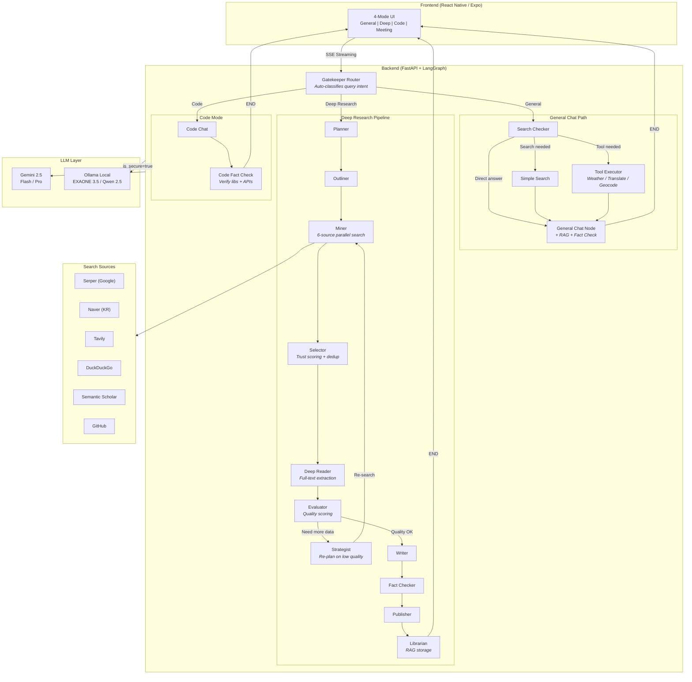
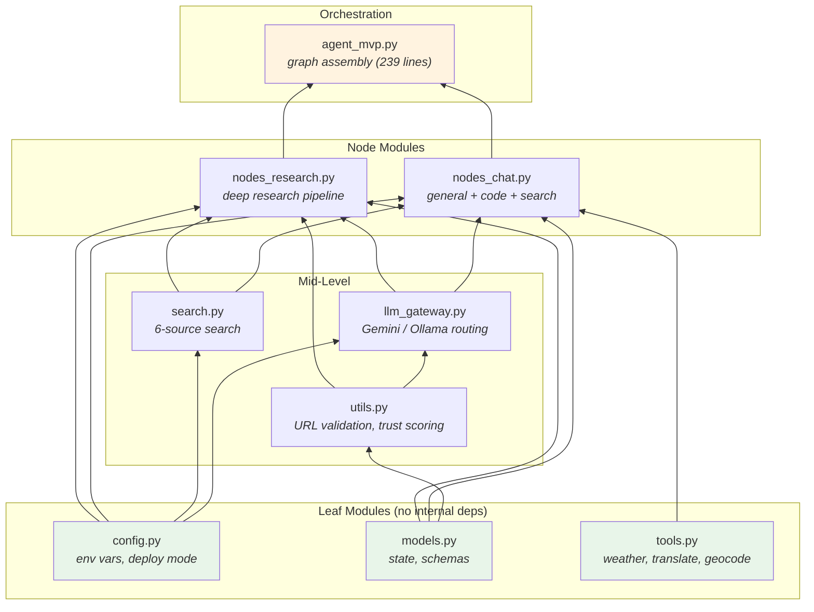

<div align="center">

# AI Secretary

### Intelligent Multi-Mode AI Assistant with Deep Research Pipeline

An LLM agent system that automatically selects the optimal response strategy based on query complexity — from instant chat to multi-source deep research reports.

[**English**](./README.md) | [**日本語**](./README.ja.md) | [**한국어**](./README.ko.md)

[](https://python.org)
[](https://fastapi.tiangolo.com)
[](https://langchain-ai.github.io/langgraph/)
[](https://reactnative.dev)
[](https://ai.google.dev)

</div>

---

## Overview

**AI Secretary** is a production-ready LLM agent system built on LangGraph's StateGraph architecture. Unlike simple chatbot wrappers, it implements a **multi-stage research pipeline** with automatic quality evaluation, self-correcting search loops, and fact-checking — producing cited, structured reports from 6+ search sources.

The system features **hybrid LLM routing** (cloud Gemini + local Ollama) with a security mode for privacy-sensitive queries, and a **modular architecture** designed for dual deployment (local GPU server / cloud SaaS).

> **Note:** This is a portfolio showcase. Source code is maintained in a private repository.

---

## Key Features

### General Chat
- Context-aware conversation with automatic web search when needed
- Hybrid keyword extraction: local LLM extracts keywords, cloud LLM optimizes search queries (privacy-preserving)
- RAG integration for document-grounded responses with `[doc p.N]` citations
- AI-suggested follow-up questions for conversation continuity

### Deep Research
- **2-4 minute** comprehensive analysis reports from 6+ search sources
- Self-correcting quality loop: Evaluator scores research quality, Strategist re-plans if insufficient
- Automatic fact-checking against source materials before publication
- Structured markdown output with per-section source accordions

### Code Assistant
- Dedicated code generation with automatic verification
- Code fact-checker validates libraries/APIs against official docs and GitHub
- Supports local model (Qwen 2.5 Coder) and cloud model (Gemini) switching

### Meeting Intelligence
- Speaker diarization (pyannote) + speech-to-text transcription
- Automatic meeting summary generation with speaker-labeled segments

### Real-time Tools
- **Weather**: Korean Meteorological Agency API with Lambert Conformal Conic grid projection
- **Translation**: Naver Papago (KO/EN/JA/ZH)
- **Geocoding**: Naver Maps address-to-coordinate conversion

---

## System Architecture



### Architecture Highlights

| Aspect | Design Decision | Why |
|--------|----------------|-----|
| **Graph Engine** | LangGraph StateGraph | Deterministic node routing > ReAct agent's unpredictable tool calls. Complex pipelines need explicit flow control |
| **Quality Loop** | Evaluator → Strategist → Miner cycle | Self-correcting research: if source quality < threshold, re-plan and re-search automatically |
| **LLM Routing** | `is_secure_mode` flag | Privacy-sensitive queries stay on local GPU (EXAONE 3.5), everything else goes to Gemini for quality |
| **Hybrid Search** | Local keyword extraction + Cloud query optimization | User's raw question never leaves local machine in secure mode; only extracted keywords are sent to cloud |
| **Checkpointing** | AsyncSqliteSaver | Conversation persistence across server restarts, supports session resumption |

---

## Tech Stack

### Backend
| Technology | Role |
|-----------|------|
| **Python 3.11** | Runtime |
| **FastAPI** | Async REST API + SSE streaming |
| **LangGraph 1.0** | StateGraph workflow orchestration |
| **LangChain** | LLM abstractions + tool integration |
| **Gemini 2.5 Flash/Pro** | Primary cloud LLM |
| **Ollama + EXAONE 3.5** | Local LLM (Korean-optimized, 7.8B) |
| **Qwen 2.5 Coder** | Local code generation model |

### Frontend
| Technology | Role |
|-----------|------|
| **React Native (Expo)** | Cross-platform mobile app |
| **TypeScript** | Type-safe development |
| **EventSource** | Real-time SSE streaming |

### AI / ML
| Technology | Role |
|-----------|------|
| **sentence-transformers** | Embedding generation (all-MiniLM-L6-v2) |
| **Faster-Whisper** | Speech-to-text |
| **pyannote.audio** | Speaker diarization |
| **EasyOCR** | Image text extraction |
| **PyMuPDF** | PDF parsing with table preservation |

### Search & Data
| Source | Type | Free Tier |
|--------|------|-----------|
| **Serper.dev** | Google Search | 2,500/month |
| **Naver Search** | Korean web/blog/news/encyclopedia | 25,000/day |
| **Tavily** | News + academic | 1,000/month |
| **DuckDuckGo** | General web | Unlimited |
| **Semantic Scholar** | Academic papers | Unlimited |
| **GitHub** | Code repositories | 5,000/hour |

---

## Module Architecture

The system was refactored from a **6,300-line monolith** into **9 focused modules** (239-line orchestration file + 6,400 lines across modules):

| Module | Lines | Responsibility |
|--------|-------|---------------|
| `config.py` | 36 | Environment variables, deployment mode (local/cloud) |
| `models.py` | 232 | State definitions, Pydantic schemas, domain trust tiers |
| `utils.py` | 523 | URL validation, trust scoring, text processing |
| `llm_gateway.py` | 419 | LLM initialization, Gemini/Ollama routing, gateway functions |
| `search.py` | 820 | 11 search functions across 6 sources |
| `tools.py` | 417 | Weather / Translation / Geocoding APIs |
| `nodes_chat.py` | 968 | General chat, code mode, search routing nodes |
| `nodes_research.py` | 2,987 | Deep research pipeline (11 nodes) |
| `agent_mvp.py` | 239 | Re-exports + StateGraph assembly |



### Dual Deployment Design

```
                    .env: DEPLOY_MODE=local          .env: DEPLOY_MODE=cloud
                    ========================         ========================
LLM Gateway         Gemini + Ollama (GPU)            Gemini only
Security Mode        Available (local LLM)            Disabled
Voice/Meeting        Enabled (GPU STT)                Disabled
Code Model           Qwen 2.5 Coder (local)           Gemini
Dependencies         Full (torch, pyannote...)         Lightweight
```

A single `DEPLOY_MODE` environment variable switches the entire system between personal (GPU) and cloud (SaaS) configurations.

---

## Deep Research Pipeline — In Detail

The deep research mode is the core differentiator. Here's how a single research query flows through 11 specialized nodes:

```
User: "Analyze the current state of AI chip market competition"
 |
 v
[1. Planner] - Analyzes query intent, determines research mode (tech/biz/policy)
              - Generates refined topic and target structure
 |
 v
[2. Outliner] - Creates structured outline with 4-6 sections
              - Generates optimized search queries per section
              - Classifies query type for source selection
 |
 v
[3. Miner] - Parallel search across 6 sources (Serper + Naver + Tavily + ...)
           - Collects 20-30 raw results per iteration
 |
 v
[4. Selector] - Trust scoring: domain tier (T1/T2/T3) + snippet relevance
              - URL validation (async batch HEAD requests)
              - Deduplication + top-K selection
 |
 v
[5. Deep Reader] - Full-text extraction via Crawl4AI
                 - Long text summarization for context window management
 |
 v
[6. Evaluator] - Scores: coverage, depth, source diversity, recency
               - Decision: PASS (→ Writer) or RETRY (→ Strategist)
 |
 v
[7. Strategist] (if RETRY) - Identifies coverage gaps
                            - Generates new targeted search queries
                            - Routes back to Miner (max 3 iterations)
 |
 v
[8. Writer] - Generates structured markdown report
            - Per-section source citations
            - Audience-adaptive tone (expert / general)
 |
 v
[9. Fact Checker] - Cross-references claims against source materials
                  - Flags unsupported statements
 |
 v
[10. Publisher] - Formats final output with source accordions
               - Generates follow-up question suggestions
 |
 v
[11. Librarian] - Stores research results in RAG vector store
               - Enables future retrieval and cross-referencing
```

---

## Performance Optimization

| Metric | Deep Research Only | With Smart Routing | Improvement |
|--------|-------------------|-------------------|-------------|
| Avg Response Time | 2-4 min | 5-10 sec (general) | **95% faster** |
| API Calls per Query | 14+ (Tavily) | 2-3 (Serper) | **86% fewer** |
| LLM Token Usage | High (all queries) | Proportional to need | **87% less** |
| Cost per Simple Query | ~$0.05 | ~$0.003 | **94% cheaper** |

### How?

The **Gatekeeper Router** classifies incoming queries into 3 paths:
1. **General Chat** — Simple questions get instant responses (no unnecessary search)
2. **Quick Fact Check** — Factual queries get 2-3 search results + brief verification
3. **Deep Research** — Complex analysis triggers the full 11-node pipeline

This routing alone reduced average API costs by **86%** compared to running deep research on every query.

---

## API Endpoints

| Endpoint | Method | Description |
|----------|--------|-------------|
| `/health` | GET | Server health check |
| `/ai_secretary/stream_v2` | POST | Main chat endpoint (SSE streaming) |
| `/ai_secretary/switch_model` | POST | Switch Ollama models (code mode) |
| `/voice/chat` | POST | Voice input → STT → LLM → response |
| `/meeting/upload` | POST | Meeting audio → diarization + summary |
| `/rag/upload` | POST | Ingest PDF/image for RAG |
| `/rag/search` | GET | Vector similarity search |
| `/rag/stats` | GET | Vector store statistics |
| `/tools/weather` | GET | Weather forecast (KMA API) |
| `/tools/translate` | POST | Text translation (Papago) |
| `/tools/geocode` | GET | Address → coordinates (Naver Maps) |

---

## Design Decisions

### Why LangGraph StateGraph over ReAct Agent?

ReAct agents choose tools dynamically, which is powerful but **unpredictable** for complex multi-step workflows. A deep research pipeline needs:
- Guaranteed execution order (search → evaluate → write)
- Conditional branching with retry logic
- State persistence across 11+ nodes
- Streaming progress updates to the frontend

StateGraph provides **deterministic routing** with explicit conditional edges, making the pipeline debuggable and reproducible.

### Why Hybrid Search (6 Sources)?

No single search API covers all needs:
- **Serper** (Google): Best general coverage, but limited free tier
- **Naver**: Essential for Korean-language sources (25K free/day)
- **Semantic Scholar**: Academic papers with citation data
- **GitHub**: Code-related research
- **DuckDuckGo**: Unlimited fallback
- **Tavily**: Good for news, but expensive at scale

The Miner node runs searches in parallel across relevant sources, and the Selector node scores and deduplicates results.

### Why SQLite for Vector Storage?

For a personal/small-team deployment:
- Zero infrastructure overhead (no Pinecone/Weaviate/Chroma server)
- Single-file backup and migration
- NumPy cosine similarity is fast enough for <100K documents
- Reduces cloud deployment costs significantly

---

## Demo

> Screenshots and demo recordings will be added here.

<!--


-->

*Coming soon: Live demo GIFs showcasing General Chat, Deep Research pipeline, and Code mode.*

---

## Contact

**Available for freelance LLM agent system development.**

I design and build production-grade AI agent systems — from architecture to deployment.

If you need:
- Custom LLM agent pipelines for your business domain
- RAG systems with domain-specific document ingestion
- Multi-source research automation tools
- Hybrid cloud/on-premise AI deployments

Feel free to reach out.

<!--
- Email: your@email.com
- LinkedIn: [Your Profile](https://linkedin.com/in/yourprofile)
- GitHub: [@yourusername](https://github.com/yourusername)
-->

---

<div align="center">

*Built with LangGraph, FastAPI, Gemini, and a lot of coffee.*

</div>
