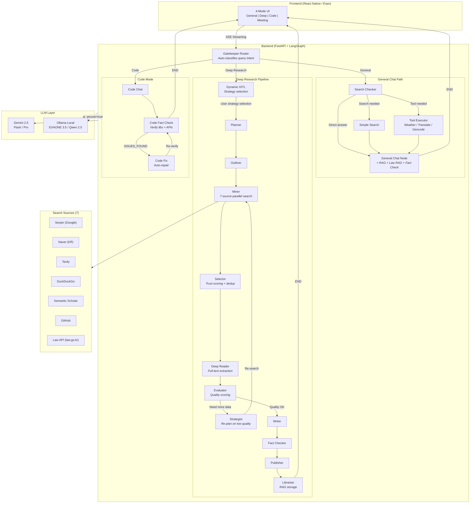
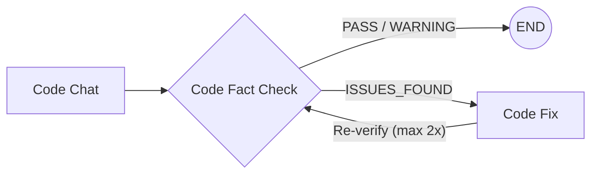

<div align="center">

# AI Secretary

### Intelligent Multi-Mode AI Assistant with Deep Research Pipeline

An LLM agent system that automatically selects the optimal response strategy based on query complexity — from instant chat to multi-source deep research reports.

[**English**](./README.md) | [**日本語**](./README.ja.md) | [**한국어**](./README.ko.md)

[](https://python.org)
[](https://fastapi.tiangolo.com)
[](https://langchain-ai.github.io/langgraph/)
[](https://reactnative.dev)
[](https://ai.google.dev)

</div>

---

## Overview

**AI Secretary** is a production-ready LLM agent system built on LangGraph's StateGraph architecture (19 nodes, conditional edges). Unlike simple chatbot wrappers, it implements a **multi-stage research pipeline** with automatic quality evaluation, self-correcting search loops, and fact-checking — producing cited, structured reports from 7 search sources.

The system features **hybrid LLM routing** (cloud Gemini + local Ollama) with a security mode for privacy-sensitive queries, **agentic self-correction loops** for code verification, **dynamic Human-in-the-Loop** for research strategy selection, and a **Korean law RAG system** powered by the Korea Legislation Research Institute API.

> **Note:** This is a portfolio showcase. Source code is maintained in a private repository.

---

## Key Features

### General Chat
- Context-aware conversation with automatic web search when needed
- Hybrid keyword extraction: local LLM extracts keywords, cloud LLM optimizes search queries (privacy-preserving)
- RAG integration for document-grounded responses with `[doc p.N]` citations
- **Law RAG**: Auto-detects legal queries and injects relevant law context with article-level citations
- AI-suggested follow-up questions for conversation continuity

### Deep Research
- **Dynamic HITL**: Before entering the pipeline, LLM generates 2-3 analysis strategy options per query — user selects or types custom direction
- **2-4 minute** comprehensive analysis reports from 7 search sources
- Self-correcting quality loop: Evaluator scores research quality, Strategist re-plans if insufficient (max 3 iterations)
- Automatic fact-checking against source materials before publication
- Structured markdown output with per-section source accordions

### Code Assistant
- Dedicated code generation with automatic verification
- **Agentic self-correction loop**: Code Fact Check detects issues → Code Fix auto-repairs → re-verification (max 2 iterations)
- Code fact-checker validates libraries/APIs against official docs and GitHub
- Supports local model (Qwen 2.5 Coder) and cloud model (Gemini) switching

### Meeting Intelligence
- Speaker diarization (pyannote) + speech-to-text transcription
- Automatic meeting summary generation with speaker-labeled segments

### Real-time Tools
- **Weather**: Korean Meteorological Agency API with Lambert Conformal Conic grid projection
- **Translation**: Naver Papago (KO/EN/JA/ZH)
- **Geocoding**: Naver Maps address-to-coordinate conversion

### Law RAG
- Korean law search via Korea Legislation Research Institute Open API (law.go.kr)
- Hybrid retrieval: vector similarity + BM25 with Reciprocal Rank Fusion
- Article-level chunking with `[Law Name Article N]` citation format
- Privacy HITL: user chooses secure (local) or cloud mode for legal queries
- Covers 14 laws (real estate + security/network domains)

---

## System Architecture



### Architecture Highlights

| Aspect | Design Decision | Why |
|--------|----------------|-----|
| **Graph Engine** | LangGraph StateGraph (19 nodes) | Deterministic node routing > ReAct agent's unpredictable tool calls. Complex pipelines need explicit flow control |
| **Quality Loop** | Evaluator → Strategist → Miner cycle | Self-correcting research: if source quality < threshold, re-plan and re-search (max 3x) |
| **Code Self-Correction** | Code Fact Check ↔ Code Fix loop | Agentic loop: detect issues → auto-fix → re-verify (max 2x) |
| **Dynamic HITL** | LLM-generated strategy options | 2-3 analysis strategies per query + custom text input, injected into Planner |
| **LLM Routing** | `is_secure_mode` flag | Privacy-sensitive queries stay on local GPU (EXAONE 3.5), everything else goes to Gemini |
| **LLM Gateway** | 4 unified gateway functions | All nodes route through `ask_gemini*()` — single `is_secure` parameter switches entire system |
| **Hybrid Search** | Local keyword extraction + Cloud query optimization | User's raw question never leaves local machine in secure mode |
| **Law RAG** | Vector + BM25 hybrid with article-level chunking | Korean law search with privacy HITL (user chooses secure/cloud mode) |
| **Checkpointing** | AsyncSqliteSaver | Conversation persistence across server restarts |

---

## Tech Stack

### Backend
| Technology | Role |
|-----------|------|
| **Python 3.11** | Runtime |
| **FastAPI** | Async REST API + SSE streaming |
| **LangGraph 1.0** | StateGraph workflow orchestration (19 nodes, conditional edges) |
| **LangChain** | LLM abstractions + tool integration |
| **Gemini 2.5 Flash/Pro** | Primary cloud LLM |
| **Ollama + EXAONE 3.5** | Local LLM (Korean-optimized, 7.8B) |
| **Qwen 2.5 Coder** | Local code generation model |

### Frontend
| Technology | Role |
|-----------|------|
| **React Native (Expo)** | Cross-platform mobile app |
| **TypeScript** | Type-safe development |
| **EventSource** | Real-time SSE streaming |
| **SimpleMarkdown** | Custom lightweight markdown renderer |

### AI / ML
| Technology | Role |
|-----------|------|
| **sentence-transformers** | Embedding (all-MiniLM-L6-v2 + ko-sroberta) |
| **Faster-Whisper** | Speech-to-text |
| **pyannote.audio** | Speaker diarization |
| **EasyOCR** | Image text extraction |
| **PyMuPDF** | PDF parsing with table preservation |

### Search & Data
| Source | Type | Free Tier |
|--------|------|-----------|
| **Serper.dev** | Google Search | 2,500/month |
| **Naver Search** | Korean web/blog/news/encyclopedia | 25,000/day |
| **Tavily** | News + academic | 1,000/month |
| **DuckDuckGo** | General web | Unlimited |
| **Semantic Scholar** | Academic papers | Unlimited |
| **GitHub** | Code repositories | 5,000/hour |
| **Law API** | Korean legislation (law.go.kr) | Unlimited |

---

## Module Architecture

The system was refactored from a **6,300-line monolith** into **9 focused modules**:

| Module | Lines | Responsibility |
|--------|-------|---------------|
| `config.py` | 60 | Environment variables, deployment mode (local/cloud), multi-backend settings |
| `models.py` | 287 | State definitions (dynamic HITL + code self-correction fields), schemas, domain trust tiers |
| `utils.py` | 523 | URL validation, trust scoring, text processing |
| `llm_gateway.py` | 447 | Unified LLM gateway, Gemini/Ollama routing, multi-backend extension point |
| `search.py` | 820 | 11 search functions across 7 sources |
| `tools.py` | 417 | Weather / Translation / Geocoding APIs |
| `nodes_chat.py` | 1,218 | General chat, code mode, dynamic HITL, code self-correction nodes |
| `nodes_research.py` | 3,000 | Deep research pipeline (11 nodes, all gateway-integrated) |
| `agent_mvp.py` | 254 | Re-exports + StateGraph assembly (19 nodes, conditional edges) |

### Dual Deployment Design

```
                    .env: DEPLOY_MODE=local          .env: DEPLOY_MODE=cloud
                    ========================         ========================
LLM Gateway         Gemini + Ollama (GPU)            Gemini only
Security Mode        Available (local LLM)            Disabled
Voice/Meeting        Enabled (GPU STT)                Disabled
Code Model           Qwen 2.5 Coder (local)           Gemini
Dependencies         Full (torch, pyannote...)         Lightweight
```

A single `DEPLOY_MODE` environment variable switches the entire system between personal (GPU) and cloud (SaaS) configurations.

---

## Agentic Reasoning

### 1. Code Mode — Self-Correction Loop

After code generation, an **agentic loop** automatically verifies, detects issues, fixes, and re-verifies:



- **Code Fact Check**: Extracts libraries/APIs from generated code → validates against official docs + GitHub
- **Code Fix**: On ISSUES_FOUND, LLM auto-repairs using verification results as context
- **Re-verification**: Fixed code goes back through Fact Check — max 2 iterations before delivery

### 2. Dynamic HITL (Human-in-the-Loop)

Before deep research, LLM dynamically generates analysis strategy options tailored to each query:

1. User question → LLM generates 2-3 strategy options (JSON)
2. Options sent via SSE to frontend
3. Frontend renders dynamic buttons + free-text input (TextInput)
4. User selection → `selected_option` injected into Planner
5. Planner adjusts `refined_topic` and research direction based on selection

**Custom input**: `custom:` prefix convention distinguishes LLM-generated options from user-typed free text.

### 3. LLM Gateway Integration

All LLM calls across all nodes (11 deep research + chat + code) are unified through 4 gateway functions:

| Function | Purpose |
|----------|---------|
| `ask_gemini()` | General text response |
| `ask_gemini_json()` | JSON structured response |
| `ask_gemini_high()` | Pro model priority (Flash fallback) |
| `ask_gemini_high_json()` | Pro + JSON |

A single `is_secure` parameter switches the entire system between Gemini (cloud) and Ollama (local).

### 4. Law RAG with Privacy HITL

When a legal query is detected, the system offers a privacy choice before proceeding:

1. Legal keyword detected in user query
2. If security mode is off → presents privacy HITL buttons
3. User chooses: Secure Mode (local LLM) or Cloud Mode (Gemini)
4. RAG search runs locally regardless → law context injected into response
5. Final answer generated with article-level citations and disclaimer

---

## Deep Research Pipeline — In Detail

The deep research mode is the core differentiator. Here's how a single research query flows through 11 specialized nodes:

```
User: "Analyze the current state of AI chip market competition"
 |
 v
[Dynamic HITL] - LLM generates 2-3 analysis strategy options
               - User selects strategy or types custom direction
 |
 v
[1. Planner] - Reads selected_option, adjusts research direction
             - Generates refined topic and target structure
 |
 v
[2. Outliner] - Creates structured outline with 4-6 sections
              - Generates optimized search queries per section
 |
 v
[3. Miner] - Parallel search across 7 sources (Serper + Naver + Tavily + ...)
           - Collects 20-30 raw results per iteration
 |
 v
[4. Selector] - Trust scoring: domain tier (T1/T2/T3) + snippet relevance
              - URL validation (async batch HEAD requests)
              - Deduplication + top-K selection
 |
 v
[5. Deep Reader] - Full-text extraction via Crawl4AI
                 - Long text summarization for context window management
 |
 v
[6. Evaluator] - Scores: coverage, depth, source diversity, recency
               - Decision: PASS (→ Writer) or RETRY (→ Strategist)
 |
 v
[7. Strategist] (if RETRY) - Identifies coverage gaps
                            - Generates new targeted search queries
                            - Routes back to Miner (max 3 iterations)
 |
 v
[8. Writer] - Generates structured markdown report
            - Per-section source citations
            - Audience-adaptive tone (expert / general)
 |
 v
[9. Fact Checker] - Cross-references claims against source materials
                  - Flags unsupported statements
 |
 v
[10. Publisher] - Formats final output with source accordions
               - Generates follow-up question suggestions
 |
 v
[11. Librarian] - Stores research results in RAG vector store
               - Enables future retrieval and cross-referencing
```

---

## Performance Optimization

| Metric | Before (All Deep Research) | After (Smart Routing) | Improvement |
|--------|---------------------------|----------------------|-------------|
| Avg Response Time | 2-4 min for every query | 1-5 sec for general chat | **95% faster** for simple queries |
| Search API Calls | 14+ per query (Tavily) | 0-3 per query (Serper) | **~80% fewer** |
| LLM Token Usage | Full pipeline every time | Proportional to complexity | Significant reduction |

The **Gatekeeper Router** classifies incoming queries into 2 primary paths:
1. **General Chat** — Simple questions, fact checks, and searchable queries get instant responses. Search and quick fact-checking are handled inline within the chat node
2. **Deep Research** — Only complex, multi-aspect analysis triggers the full 11-node pipeline

This 2-layer routing (Gatekeeper → Search Checker) eliminates unnecessary computation for the majority of queries.

---

## API Endpoints

| Endpoint | Method | Description |
|----------|--------|-------------|
| `/health` | GET | Server health check |
| `/ai_secretary/stream_v2` | POST | Main chat endpoint (SSE streaming) |
| `/ai_secretary/switch_model` | POST | Switch Ollama models (code mode) |
| `/voice/chat` | POST | Voice input → STT → LLM → response |
| `/meeting/upload` | POST | Meeting audio → diarization + summary |
| `/rag/upload` | POST | Ingest PDF/image for RAG |
| `/rag/search` | GET | Vector similarity search |
| `/rag/stats` | GET | Vector store statistics |
| `/tools/weather` | GET | Weather forecast (KMA API) |
| `/tools/translate` | POST | Text translation (Papago) |
| `/tools/geocode` | GET | Address → coordinates (Naver Maps) |
| `/law/crawl` | POST | Crawl Korean legislation |
| `/law/search` | GET | Law search (Vector + BM25 hybrid) |
| `/law/update` | POST | Re-crawl updated laws only |

---

## Design Decisions

### Why LangGraph StateGraph over ReAct Agent?

ReAct agents choose tools dynamically, which is powerful but **unpredictable** for complex multi-step workflows. A 19-node workflow needs:
- Guaranteed execution order (search → evaluate → write)
- Conditional branching with retry logic (Evaluator → Strategist → Miner, max 3x)
- Agentic loops: code self-correction (code_fact_check ↔ code_fix, max 2x)
- SSE streaming for real-time progress updates + dynamic HITL option delivery
- State persistence across server restarts (AsyncSqliteSaver checkpointing)

StateGraph provides **deterministic routing** with explicit conditional edges, making the pipeline debuggable and reproducible.

### Why Hybrid Search (7 Sources)?

No single search API covers all needs:
- **Serper** (Google): Best general coverage, but limited free tier
- **Naver**: Essential for Korean-language sources (25K free/day)
- **Semantic Scholar**: Academic papers with citation data
- **GitHub**: Code-related research
- **DuckDuckGo**: Unlimited fallback
- **Tavily**: Good for news, but expensive at scale
- **Law API** (law.go.kr): Korean legislation with article-level precision

### Why SQLite for Vector Storage?

For a personal/small-team deployment:
- Zero infrastructure overhead (no Pinecone/Weaviate/Chroma server)
- Single-file backup and migration
- NumPy cosine similarity is fast enough for <100K documents
- Reduces cloud deployment costs significantly

---

## Demo

> Screenshots and demo recordings will be added here.

<!--


-->

*Coming soon: Live demo GIFs showcasing General Chat, Deep Research pipeline, and Code mode.*

---

## Contact

**Available for freelance LLM agent system development.**

I design and build production-grade AI agent systems — from architecture to deployment.

If you need:
- Custom LLM agent pipelines for your business domain
- RAG systems with domain-specific document ingestion
- Multi-source research automation tools
- Hybrid cloud/on-premise AI deployments

Feel free to reach out.

- Email: parupin72@gmail.com
<!-- - LinkedIn: [Your Profile](https://linkedin.com/in/yourprofile) -->
- GitHub: [@leovis87](https://github.com/leovis87)

---

<div align="center">

*Built with LangGraph, FastAPI, Gemini, and a lot of coffee.*

</div>
