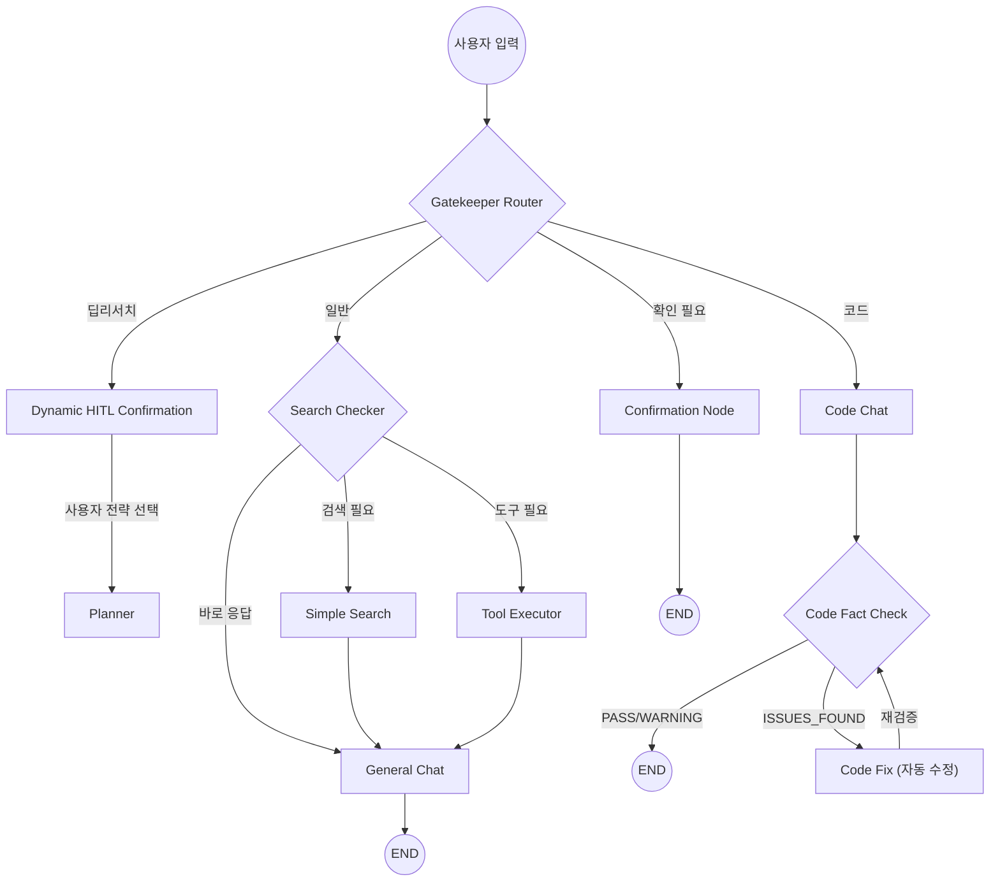
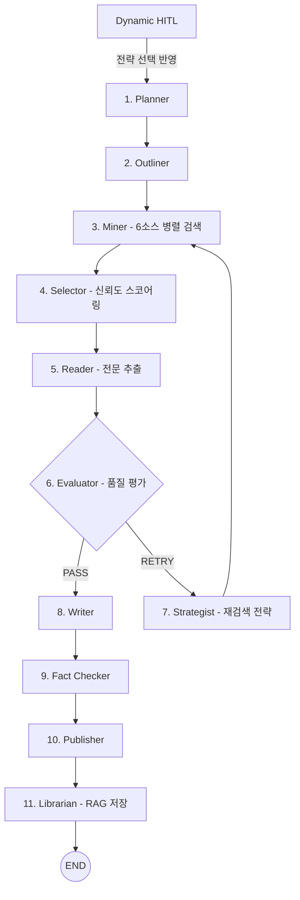
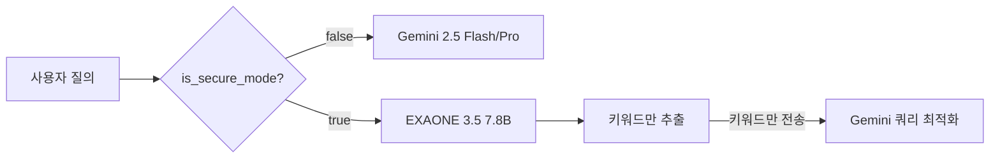
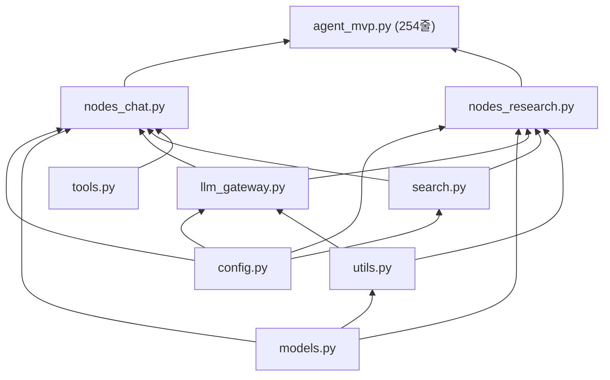

# AI Deep Research Assistant

**개발 기간:** 2025.01 ~ 2025.02 (계속 개선 중)
**GitHub:** [https://github.com/leovis87](https://github.com/leovis87)
**시연 영상:** [https://youtu.be/X5ZZsArnIgI](https://youtu.be/X5ZZsArnIgI?si=ae8kjMtiSfXRFhZd)

**Tech Stack:**
`React Native` `TypeScript` `Python` `FastAPI` `LangGraph` `Google Gemini 2.5` `Ollama` `EXAONE 3.5` `Qwen 2.5 Coder` `sentence-transformers` `Faster-Whisper` `pyannote.audio` `EasyOCR` `Crawl4AI`

---

## 프로젝트 개요

질문의 복잡도에 따라 **최적의 응답 전략을 자동 선택**하는 LLM 에이전트 시스템.
단순 질문은 즉시 응답, 복잡한 질문은 6개 검색 소스에서 자동 리서치 → 팩트체크 → 출처 포함 보고서를 생성합니다.

### 핵심 가치

- **정확성**: 모든 답변에 출처 제공 + 자동 팩트체크로 환각(Hallucination) 최소화
- **비용 효율**: 2계층 라우팅(Gatekeeper → Search Checker)으로 불필요한 API 호출 제거
- **프라이버시**: 보안 모드(로컬 LLM) 지원 — 민감한 질문은 외부 전송 없이 처리

---

## 4가지 모드

| 모드 | 설명 | 응답 시간 |
|------|------|----------|
| **일반 채팅** | 웹 검색 + 빠른 팩트체크 인라인 처리, RAG 문서 참조 | 1-5초 |
| **딥리서치** | 11노드 파이프라인, 자동 품질 평가 + 재검색 루프 | 2-4분 |
| **코드** | 코드 생성 + 자동 검증 + 에이전틱 자기수정 루프 (최대 2회) | 5-30초 |
| **회의** | 오디오 업로드 → 화자 분리 → 자동 요약 | 1-3분 |

---

## 시스템 아키텍처

### 1. Gatekeeper 라우팅



### 2. 딥리서치 파이프라인 (동적 HITL + 11노드)



**동적 HITL (Human-in-the-Loop)**: 딥리서치 진입 전, LLM이 사용자 질문을 분석하여 2~3개의 분석 전략 옵션을 동적 생성 → 프론트엔드에서 버튼으로 렌더링. 사용자가 선택하거나 직접 입력한 방향이 Planner에 주입되어 연구 전략을 결정.

**예시 (질문: "전기차 시장 전망은?"):**
- 📊 시장 분석 — 시장 규모, 성장률, 주요 업체 비교
- 🔧 기술 동향 — 배터리/충전 기술 발전 방향
- 💬 직접 입력 — 사용자가 원하는 분석 방향 자유 입력

### 3. LLM 라우팅 (보안 모드)



**하이브리드 검색**: 보안 모드에서도 검색 품질 유지
1. 로컬 LLM이 사용자 질문에서 **키워드만 추출**
2. 키워드만 Gemini에 전달 → 검색 쿼리 최적화
3. 사용자 원문은 로컬 머신을 벗어나지 않음

---

## 검색 시스템 (6개 소스 통합)

| 소스 | 용도 | 무료 할당량 |
|------|------|-----------|
| **Serper.dev** | Google 검색 (메인) | 2,500회/월 |
| **네이버 검색** | 한국어 블로그/뉴스/백과 | 25,000회/일 |
| **Tavily** | 뉴스 + 학술 (폴백) | 1,000회/월 |
| **DuckDuckGo** | 범용 웹 (무제한 폴백) | 무제한 |
| **Semantic Scholar** | 학술 논문 | 무제한 |
| **GitHub** | 코드 저장소 | 5,000회/시 |

Miner 노드가 질의 유형에 따라 관련 소스를 **병렬 검색** → Selector가 도메인 티어(T1/T2/T3) 기반 신뢰도 스코어링 + 중복 제거.

---

## RAG 파이프라인

| 데이터 소스 | 처리 방식 |
|-----------|----------|
| PDF | PyMuPDF (테이블 보존, 페이지별 메타데이터) |
| 이미지 | EasyOCR → 텍스트 추출 |
| 리서치 결과 | 딥리서치 완료 후 자동 저장 |
| 채팅 | 선택적 저장 |

- 임베딩: sentence-transformers (all-MiniLM-L6-v2)
- 저장: **SQLite + NumPy 코사인 유사도** (외부 벡터 DB 없이 자체 구현)
- 인용: `[doc p.N]` 형식으로 페이지 수준 출처 추적
- 숫자가 포함된 답변 → **정확 인용 프롬프트** 자동 적용 (환각 방지)

---

## 모듈 아키텍처

6,300줄 모놀리스 → **9개 모듈**로 리팩토링 (듀얼 배포 대응):

| 모듈 | 줄 수 | 역할 |
|------|------|------|
| `config.py` | 60 | 환경변수, 배포 모드 (local/cloud), 멀티백엔드 설정 |
| `models.py` | 287 | 상태 정의 (동적 HITL/코드 자기수정 필드 포함), 스키마, 도메인 티어 |
| `utils.py` | 523 | URL 검증, 신뢰도 스코어링, 텍스트 처리 |
| `llm_gateway.py` | 447 | LLM 통합 게이트웨이, Gemini/Ollama 라우팅, 멀티백엔드 확장점 |
| `search.py` | 820 | 6개 소스 11개 검색 함수 |
| `tools.py` | 417 | 날씨(기상청) / 번역(파파고) / 지오코딩(네이버지도) |
| `nodes_chat.py` | 1,218 | 일반 채팅, 코드 모드, 동적 HITL, 코드 자기수정 노드 |
| `nodes_research.py` | 3,000 | 딥리서치 파이프라인 11개 노드 (전 노드 게이트웨이 통합) |
| `agent_mvp.py` | 254 | 모듈 재수출 + StateGraph 조립 (19노드, 조건부 에지) |

### 4. 모듈 의존성 다이어그램



### 듀얼 배포

`.env`의 `DEPLOY_MODE` 하나로 로컬(GPU) ↔ 클라우드(SaaS) 전환:

```
DEPLOY_MODE=local  →  Gemini + Ollama, 음성/회의 활성화, 전체 기능
DEPLOY_MODE=cloud  →  Gemini only, 경량 의존성, 보안 모드 비활성화
```

---

## 성능 최적화

| 지표 | 변경 전 (모든 질의 딥리서치) | 변경 후 (스마트 라우팅) |
|------|--------------------------|----------------------|
| 평균 응답 시간 | 모든 질의 2-4분 | 일반 채팅 1-5초 |
| 검색 API 호출 | 쿼리당 14회+ | 쿼리당 0-3회 |
| LLM 토큰 사용량 | 매번 전체 파이프라인 | 복잡도에 비례 |

**2계층 라우팅**(Gatekeeper → Search Checker)으로 대부분의 질의에서 불필요한 연산 제거.
간단한 질문, 팩트체크, 도구 호출은 채팅 노드 내부에서 인라인 처리.

---

## 에이전틱 추론 (Agentic Reasoning)

### 1. 코드 모드 — 자기수정 루프

코드 생성 후 **자동 검증 → 문제 감지 → 자동 수정 → 재검증**하는 에이전틱 루프:

```mermaid
flowchart LR
    CC["Code Chat"] --> CF{"Code Fact Check"}
    CF -->|PASS / WARNING| END(("END"))
    CF -->|ISSUES_FOUND| FIX["Code Fix"]
    FIX -->|재검증 (최대 2회)| CF
```

- **Code Fact Check**: 생성된 코드에서 라이브러리/API를 추출 → 공식 문서 + GitHub 검색으로 실제 존재 여부 검증
- **Code Fix**: ISSUES_FOUND 판정 시 LLM이 검증 결과를 참고하여 자동 수정
- **재검증**: 수정된 코드를 다시 Fact Check → 최대 2회 반복 후 사용자에게 전달
- `code_review_status`: PASS | WARNING | ISSUES_FOUND
- `code_fix_iteration`: 0 → 1 → 2 (최대)

### 2. 동적 HITL (Human-in-the-Loop)

딥리서치 진입 시, 질문에 맞는 분석 전략을 LLM이 동적으로 생성:

**플로우:**
1. 사용자 질문 → LLM이 2~3개 분석 전략 옵션 생성 (JSON)
2. SSE로 프론트엔드에 옵션 배열 전달
3. 프론트엔드에서 동적 버튼 렌더링 + 직접 입력(TextInput) 제공
4. 사용자 선택 → `selected_option` 값이 Planner에 주입
5. Planner가 선택된 전략에 맞게 `refined_topic`과 연구 방향 조정

**커스텀 입력:** `custom:` 접두사 규약으로 LLM 생성 옵션과 사용자 자유 입력을 구분.

### 3. LLM Gateway 통합

모든 노드(11개 딥리서치 + 채팅 + 코드)의 LLM 호출을 `ask_gemini*()` 게이트웨이 4개 함수로 통합:

| 함수 | 용도 |
|------|------|
| `ask_gemini()` | 일반 텍스트 응답 |
| `ask_gemini_json()` | JSON 구조화 응답 |
| `ask_gemini_high()` | Pro 모델 우선 (Flash 폴백) |
| `ask_gemini_high_json()` | Pro + JSON |

**효과:**
- `is_secure` 파라미터 하나로 전체 시스템의 Gemini ↔ Ollama 전환
- 직접 `.invoke()` 호출 8건 제거 → 게이트웨이 경유로 일원화
- 백엔드 교체 시 게이트웨이 내부만 수정 (확장점 문서화 완료)

---

## 핵심 트러블슈팅

### 1. 딥리서치 보고서 구조가 질문과 무관한 문제

**문제:** 모든 질문에 대해 "Executive Summary → Architecture → Technical Specs → Implementation Guide" 같은 고정 템플릿이 적용됨. "전기차 vs 수소차 비교해줘"라고 물어도 "Implementation Guide (코드 예시)" 섹션이 생성됨.

**원인:** 프롬프트에서 하드코딩된 구조를 `MUST follow`로 강제 지시 → LLM이 질문 맥락을 무시하고 템플릿을 그대로 출력.

**해결:** 하드코딩 구조를 **Fallback**으로 전환. LLM이 사용자 질문에 맞는 자연스러운 섹션 제목을 우선 생성하되, 생성 불가 시에만 기본 템플릿 사용.

**결과:** "두 기술의 현황 → 장단점 비교 → 환경적 영향 → 미래 전망" 같이 질문에 맞는 구조로 개선.

### 2. Deep Research 취소 시 무한 루프

**문제:** 사용자가 딥리서치 확인 팝업에서 "취소" 클릭 → 같은 질문 재전송 → Gatekeeper가 다시 딥리서치 분류 → 팝업 재출현 → 무한 반복.

**해결:** 취소 시 `force_mode` 파라미터로 Gatekeeper 라우터를 우회하여 일반 채팅으로 강제 전환. "취소 = 딥리서치 하지 마"라는 사용자 의도를 반영.

### 3. React Native Markdown 라이브러리 레이아웃 파괴

**문제:** `react-native-markdown-display` 내부의 하드코딩된 `flex: 1`이 ScrollView 안에서 말풍선을 무한 확장시킴. style prop, rules prop 등 모든 외부 오버라이드 시도 실패.

**해결:** 라이브러리를 완전히 제거하고, 순수 `<Text>` + `<View>` 기반의 경량 커스텀 마크다운 렌더러 `SimpleMarkdown`을 직접 구현. 헤딩/볼드/이탤릭/리스트/코드블록/테이블/링크 지원.

**교훈:** 서드파티 라이브러리의 내부 스타일은 외부에서 완전히 제어 불가능할 수 있음. 복잡한 수정보다 요구사항에 맞는 경량 구현이 나을 수 있음.

---

## 기술 스택

### Backend

| 기술 | 버전 | 역할 |
|------|------|------|
| Python | 3.11 | 런타임 |
| FastAPI | 0.128 | 비동기 REST API + SSE 스트리밍 |
| LangGraph | 1.0.5 | StateGraph 워크플로우 (19노드, 조건부 에지) |
| LangChain | 1.2.0 | LLM 추상화 + 도구 통합 |
| Gemini 2.5 | Flash / Pro | 클라우드 LLM (메인) |
| Ollama + EXAONE 3.5 | 7.8B | 로컬 LLM (한국어 최적화, 보안 모드) |
| Qwen 2.5 Coder | 7B | 로컬 코드 생성 모델 |
| sentence-transformers | - | 임베딩 (all-MiniLM-L6-v2) |
| Faster-Whisper | - | STT (음성 → 텍스트) |
| pyannote.audio | 3.1+ | 화자 분리 (회의 모드) |
| EasyOCR | 1.7 | 이미지 → 텍스트 (RAG 수집) |
| PyMuPDF | 1.26 | PDF 파싱 (테이블 보존) |
| Crawl4AI | 0.7.8 | 웹페이지 전문 추출 |

### Frontend

| 기술 | 버전 | 역할 |
|------|------|------|
| React Native | 0.81.5 | 크로스플랫폼 모바일 앱 |
| Expo Router | 6.0 | 라우팅 |
| TypeScript | 5.9 | 타입 안전 개발 |
| EventSource (SSE) | - | 실시간 스트리밍 |
| SimpleMarkdown | 자체 구현 | 커스텀 마크다운 렌더러 |

### 검색 & 외부 API

| 서비스 | 역할 |
|--------|------|
| Serper.dev | Google 검색 (메인) |
| 네이버 검색 API | 한국어 특화 (블로그/뉴스/백과/지식인/쇼핑) |
| Tavily | 뉴스 + 학술 (폴백) |
| DuckDuckGo | 무제한 범용 폴백 |
| Semantic Scholar | 학술 논문 (인용 데이터) |
| GitHub API | 코드 저장소 검색 |
| 기상청 API | 날씨 (Lambert 정각원추도법 격자 변환) |
| 네이버 Papago | 번역 (한/영/일/중) |
| 네이버 지도 | 지오코딩 (주소 → 좌표) |

---

## API 엔드포인트

| 엔드포인트 | 메서드 | 설명 |
|-----------|--------|------|
| `/ai_secretary/stream_v2` | POST | 메인 채팅 (SSE 스트리밍) |
| `/ai_secretary/switch_model` | POST | Ollama 모델 전환 (코드 모드) |
| `/voice/chat` | POST | 음성 입력 → STT → LLM → 응답 |
| `/meeting/upload` | POST | 회의 오디오 → 화자 분리 + 요약 |
| `/rag/upload` | POST | PDF/이미지 RAG 수집 |
| `/rag/search` | GET | 벡터 유사도 검색 |
| `/tools/weather` | GET | 날씨 (기상청 API) |
| `/tools/translate` | POST | 번역 (파파고) |
| `/tools/geocode` | GET | 주소 → 좌표 (네이버 지도) |

---

## 설계 결정

### LangGraph StateGraph를 선택한 이유

ReAct 에이전트는 도구를 동적으로 선택하는 강점이 있지만, 19노드 워크플로우에는 **결정론적 라우팅**이 필수:
- 보장된 실행 순서 (검색 → 평가 → 작성)
- 조건부 분기 + 재시도 로직 (Evaluator → Strategist → Miner, 최대 3회)
- 에이전틱 루프: 코드 모드 자기수정 (code_fact_check ↔ code_fix, 최대 2회)
- SSE를 통한 실시간 진행률 업데이트 + 동적 HITL 옵션 전달
- 서버 재시작 후에도 세션 복원 (AsyncSqliteSaver 체크포인팅)

### SQLite 벡터 저장소를 선택한 이유

Pinecone/Weaviate/Chroma 같은 외부 벡터 DB 대신 **SQLite + NumPy**를 선택:
- 제로 인프라 오버헤드 (단일 파일)
- <100K 문서에서 충분한 성능
- 클라우드 배포 비용 대폭 절감
- 백업 = 파일 복사

---

## 개발 방식

- 시스템 아키텍처 및 핵심 로직 **직접 설계**
- AI 코딩 어시스턴트를 활용하여 구현 속도 향상
- 디버깅 및 문제 해결은 **직접 분석 후 방향 결정**

---

## Contact

- **Email:** parupin72@gmail.com
- **GitHub:** [https://github.com/leovis87](https://github.com/leovis87)
